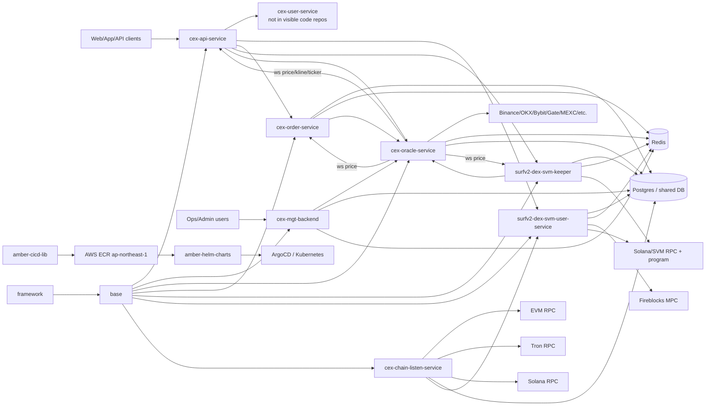

# ADR 0001: Current Turboflow Repo Topology

Status: Draft  
Date: 2026-05-14  
Source: local clone of `turboflow-xyz` repos plus `amber-helm-charts`

## Executive View

Turboflow is currently shaped as a Go microservice trading platform with a shared foundation, an API/control plane, a market-data/oracle plane, an order/execution plane, a chain/asset plane, and a GitHub Actions + ECR + Helm + ArgoCD deployment plane.

The visible GitHub org slice has 14 repos. The Helm deployment repo references 41 app names, so the deployment surface is larger than the code repos currently visible in `turboflow-xyz`.

## Functional Positioning

| Layer | Repos | Role |
|------|-------|------|
| Shared foundation | `framework`, `base`, `turboflow-fireblocks-sdk-go` | HTTP/server, DB, Redis, monitoring, shared constants/entities, sys_config access, RPC clients, chain clients, Fireblocks integration |
| Public/API edge | `cex-api-service` | User-facing HTTP and WebSocket API; account, market, pool, task, third-party, inbox, campaign, and statistics surfaces |
| Admin/control | `cex-mgt-backend` | Admin backend, finance/risk/rule/user management, migrations, monitoring, pair/service operations |
| Market data / oracle | `cex-oracle-service`, `oracle-slippage` | Exchange/DEX data ingestion, token/pair pricing, kline/ticker WebSockets, slippage and pair validation |
| CEX/order execution | `cex-order-service` | Order, pool, reward, risk, statistics, matcher/scheduler services; consumes oracle price WebSocket |
| DEX/SVM execution | `surfv2-dex-svm-keeper` | Solana/SVM keeper execution, pool/order operations, scanner, voucher/dreamfund flows, chain RPC interaction |
| DEX asset/user plane | `surfv2-dex-svm-user-service` | User wallet, asset, withdraw, bridge, Fireblocks/provider tx callback, token approval APIs |
| Chain ingestion | `cex-chain-listen-service` | EVM/Solana/Tron deposit and DEX bridge/listen services; token sync; chain event HTTP API |
| New domain app | `turbo-soccer-book-service` | Standalone soccer book/betting domain with mock-first match, market, bet, settle, account, and chain modules |
| Delivery platform | `amber-cicd-lib`, `amber-helm-charts` | Reusable GitHub Actions workflow, ECR image publishing, Helm values updates, ArgoCD deployment charts |

## Topology

## Code-Proven Service Edges

- `base/store/sys_config.go` centralizes runtime service discovery via `OracleServiceAddress`, `OrderServiceAddress`, and `KeeperServiceAddress`.
- `base/rpc/user` defaults to `cex-user-service-svc:8010` for CEX user/asset APIs and `surfv2-dex-svm-user-service-svc:8010` for DEX user/asset APIs.
- `base/rpc/pool` defaults to `cex-order-service-svc:8010`.
- `base/rpc/listen` defaults to `cex-chain-listen-service-svc:8010`.
- `cex-api-service/http/router.go` explicitly sets RPC URLs for `cex-user-service`, `surfv2-dex-svm-user-service`, and `cex-order-service`.
- `cex-api-service` subscribes to oracle ticker/kline WebSockets and calls oracle HTTP price/kline endpoints.
- `cex-api-service` routes order/pool calls to either `cex-order-service` or `surfv2-dex-svm-keeper` depending on trading platform paths.
- `cex-order-service` and `surfv2-dex-svm-keeper` both consume oracle price WebSocket feeds and expose HTTP APIs on `:8010`; both expose Prometheus metrics on `:8020`.
- `surfv2-dex-svm-user-service` owns wallet, approval, withdraw, asset, provider transaction log, and Fireblocks callback APIs for the DEX/SVM path.
- `cex-chain-listen-service` runs deposit listeners across EVM, Solana, and Tron plus DEX bridge listeners, then exposes wallet/listen APIs on `:8010`.

## Deployment Topology

- Service repos use GitHub Actions on `main`, `uat`, and `sit`.
- Builds push Docker images to AWS ECR account `954774582998` in `ap-northeast-1`.
- Image repository naming is `cex-backend-{project_name}-{prod|nonprod}`.
- `sit` and `uat` builds auto-update `amber-helm-charts` values; `main` builds require manual Helm values update and ArgoCD sync.
- `amber-helm-charts` contains 41 app chart directories, including apps not currently present as code repos in this GitHub org sync.

## Architecture Findings

- The main architectural center of gravity is `base` + `framework`; nearly every service imports both.
- Runtime topology is largely configuration-driven through DB-backed `sys_config`, not static config files.
- The system mixes CEX-style order/pool services and DEX/Solana keeper/user services behind the public `cex-api-service`.
- `cex-oracle-service` and `oracle-slippage` are structurally very similar; `oracle-slippage` appears to be a slippage-focused or forked oracle variant.
- `cex-order-service` has module path `github.com/turboflow-xyz/order-service`, which differs from the repo name and should be treated carefully in tooling.
- `turbo-soccer-book-service` is architecturally cleaner and more self-contained than the older exchange services; it uses explicit domain modules and mock-first adapters.

## Gaps And Risks

- Helm references code/deploy apps not visible as repos here: `cex-user-service`, `wallet-service`, `quote-service`, `sign-service`, frontends, and several chain/support services.
- Several repos still contain GitLab CI remnants next to GitHub Actions, which may confuse release ownership.
- Some service docs are template defaults or operational scratchpads rather than reliable product documentation.
- At least one settings path appears to contain hard-coded third-party credential material; this needs a focused secrets audit before broad operational work.
- Direct service-to-service HTTP URLs and sys_config keys are spread across shared RPC wrappers and service code; topology should be generated from code plus deployment manifests, not inferred manually long-term.

## Next Topology Pass

1. Build a generated Go module/import graph for all visible repos.
2. Map `amber-helm-charts/apps/*` to code repos and list orphaned charts.
3. Extract all service ports, health endpoints, metrics ports, and ECR image names from Dockerfiles/workflows/Helm values.
4. Trace four critical user journeys: login/session, create order, deposit/withdraw, and oracle price update to API WebSocket push.
5. Inventory DB tables and `sys_config` keys used by each service.
