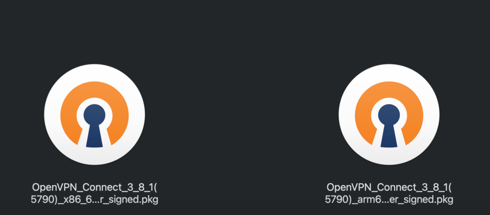

# Internal VPN Guide

Status: Active technical asset  
Owner: Infrastructure / operations  
Sensitivity: Internal. Do not commit `.ovpn` profiles, private keys, MFA secrets, or personal credentials.

## Purpose

Use the company VPN to access Turboflow internal services such as Prometheus, Grafana, Kibana, GitLab, and ArgoCD.

The imported source profile is stored locally at:

```text
ops/private/vpn/tf-internal-vpn.ovpn
```

That file includes embedded key material and is intentionally ignored by git.

## Prerequisites

- OpenVPN Connect client
- Turboflow VPN profile: `tf-internal-vpn.ovpn`
- Keycloak + VPN account
- MFA configured for the account
- `vpn_access_authorization` role assigned to the account

For account provisioning or access issues, contact `@seth`.

## Install OpenVPN Connect

Download OpenVPN Connect from:

https://openvpn.net/client/

Use the installer that matches your operating system:

| System | Install path |
| --- | --- |
| Windows | Download OpenVPN Connect for Windows |
| macOS | Download OpenVPN Connect for macOS; Apple Silicon Macs use the ARM64 build |
| iOS | Install OpenVPN Connect from the App Store |
| Android | Install OpenVPN Connect from Google Play |

Reference image:



## Import The VPN Profile

### Windows / macOS

1. Open OpenVPN Connect.
2. Choose `Upload File`, or drag `tf-internal-vpn.ovpn` into the OpenVPN Connect window.
3. Click `Add`.
4. Confirm the new profile appears as `tf-internal-vpn` or similar.

### iPhone / iPad

1. Transfer `tf-internal-vpn.ovpn` to the device with AirDrop or a secure approved file transfer path.
2. Open the file with OpenVPN Connect.
3. Tap `Add`.

### Android

1. Transfer `tf-internal-vpn.ovpn` to the device with an approved file transfer path.
2. Open OpenVPN Connect.
3. Tap `+`, choose `File`, select the `.ovpn` profile, and import it.

## Connect

1. Open OpenVPN Connect.
2. Toggle the imported `tf-internal-vpn` profile on.
3. When the browser opens, sign in with the Keycloak/VPN account.
4. Complete MFA with Google Authenticator, Authy, or another approved authenticator.
5. Return to OpenVPN Connect and confirm the profile shows `Connected`.

If the browser does not open automatically, copy the authentication URL from OpenVPN Connect logs or the terminal prompt and open it manually.

Complete the login within roughly 2 minutes. If the auth page times out, disconnect and start the connection again.

## Internal Services

After the VPN is connected, these internal services should be reachable:

| Service | URL | VPN required |
| --- | --- | --- |
| Prometheus | http://prometheus.tf-internal.xyz | Yes |
| Grafana | https://grafana.nfexinsider.com/ | Yes |
| Kibana | http://kibana.nfexinsider.com/ | Yes |
| GitLab | https://gitlab.nfexinsider.com/ | Yes |
| ArgoCD | https://argocd.nfexinsider.com/ | Yes |

Timeouts before connecting to VPN are expected.

## Troubleshooting

### Browser shows a certificate warning

This can happen during VPN authentication. Continue only if the URL is the expected company VPN or Keycloak endpoint.

### Login succeeds but VPN does not connect

- Check the local network connection.
- Disable other VPN clients temporarily.
- Check for local DNS or hosts-file overrides.
- Disconnect and reconnect the OpenVPN profile.
- Finish the browser login promptly after the auth page opens.

### Access denied

Ask the administrator to confirm the account has the `vpn_access_authorization` role.

## Security Handling

- Do not commit `.ovpn` files.
- Do not paste profile contents into tickets, chat, or docs.
- Treat embedded certificates, private keys, and `tls-crypt` keys as sensitive.
- If the profile is exposed, request a rotated profile.
