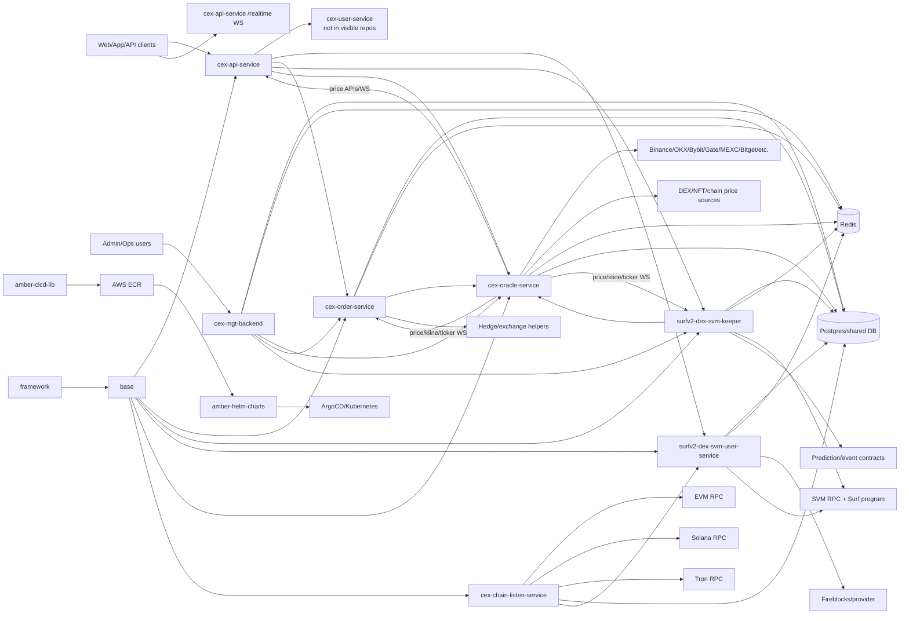

# Trade System Architecture

Status: Draft
Date: 2026-05-14
Source basis: local code repos, HQ registry, existing topology ADR, local docs, and Helm app manifests.

## Executive View

Turboflow is a Go microservice trading platform with two visible execution paths behind one public API edge:

- A CEX-style perpetual path centered on `cex-order-service`, using off-chain order/position/pool tables and risk/leverage/hedging schedulers.
- A Surf v2 SVM path centered on `surfv2-dex-svm-keeper`, where order and pool state are tied to SVM contract execution, keeper scanning, chain-status transitions, and compensation.

Both paths depend on shared market data from `cex-oracle-service`, shared contracts and entities from `base`, shared infrastructure from `framework`, Redis/Postgres-backed runtime state, and deployment via Helm/ArgoCD.

## Runtime Topology

## API Edge

`cex-api-service` is the user-facing edge. It initializes hard-coded service RPC defaults in [`http/router.go`](../../../cex-api-service/http/router.go):

- `cex-user-service-svc:8010` for CEX user APIs.
- `surfv2-dex-svm-user-service-svc:8010` for DEX/SVM user APIs.
- `cex-order-service-svc:8010` for pool/order APIs.

Its handlers expose account, trade, position, wallet, asset, withdraw, pool, market, task, token, third-party, activity, dreamfund, inbox, and rebate/agent surfaces. Its WebSocket handler exposes `/realtime` and supports public market subscriptions plus private asset/position/trade-style subscriptions documented in [`cex-api-service/README.md`](../../../cex-api-service/README.md).

Architecturally, the API edge is a facade. It does not own the full order or wallet state; it adapts user-facing routes into RPC calls, direct DAO lookups, Redis subscriptions, and oracle reads.

## CEX Perpetual Engine

`cex-order-service` is the visible CEX/off-chain perpetual engine. Its active public router is currently narrow in [`api/router.go`](../../../cex-order-service/api/router.go), but the handler and service layer contains the actual domain surface:

- Order APIs: create open/close orders, stop orders, cancel, remend, quick order, transfer margin, predict/simulate operations.
- Pool APIs: create/close pools, add/remove liquidity, add pair/collateral, pool liquidity config.
- Risk controls: pair risk, max leverage, PM/RM, scalping checks, price decimal sync, ATR calculation, weekend/stock-market modes.
- Execution loops: matcher, scheduler, hedge scheduling, exchange helpers.
- Statistics and rewards: pool/user statistics, reward/rebate support.

The README identifies core tables such as `trade_pools`, `trade_config`, `vault_asset`, `user_asset`, `trade_fill_fresh`, `trade_order_fresh`, `trade_position_fresh`, and `user_cashbooks`.

## Surf/SVM Keeper And Contract Execution

`surfv2-dex-svm-keeper` is the chain-backed execution engine. [`api/router.go`](../../../surfv2-dex-svm-keeper/api/router.go) exposes order, pool, liquidity, system, compensation, prediction-market, and dreamfund endpoints. Its README describes SVM contract configuration, RPC host config, chain-status transitions, and operational compensation APIs.

Important keeper responsibilities:

- Order lifecycle: open/close, stop/trigger orders, quick order, cancel/remend, change leverage, margin transfer.
- Pool lifecycle: create/close pool, add/remove/execute liquidity, add pair/collateral, swap.
- SVM execution: generated IDL models under `domain/model/svm_idl`, keeper execution helpers, submit/confirm/finish/compensate behavior.
- Chain status model: `Initial -> Committed | CommitFail -> Confirmed -> Finished | CommitMiss`.
- Scanner and compensation: slot/hash compensation endpoint and scan service.
- Prediction/event contracts: `CreatePredictMarketOrder`, prediction risk services, risk publication, signal/blocking config.
- Campaign-adjacent surfaces: voucher notice/service and dreamfund.

The keeper is where “contract trading engine” and “event contract” concerns are most concentrated in the visible repos.

## Prediction/Event Contract Path

Prediction-market/event-contract trading is implemented in the keeper and documented further in the risk-management theme. Current code evidence includes:

- [`predict_market_service.go`](../../../surfv2-dex-svm-keeper/domain/services/predict_market_service.go)
- [`predict_market_risk_service.go`](../../../surfv2-dex-svm-keeper/domain/services/predict_market_risk_service.go)
- [`predict_risk_pub.go`](../../../surfv2-dex-svm-keeper/domain/services/predict_risk_pub.go)
- [`api_order_service.go`](../../../surfv2-dex-svm-keeper/domain/services/api_order_service.go)
- [`预测市场json配置文档.md`](../../../surfv2-dex-svm-keeper/预测市场json配置文档.md)

Observed responsibilities:

- Accept prediction orders via keeper endpoints.
- Use oracle price and staleness checks before opening.
- Apply relative oracle slippage controls.
- Apply fixed blackout windows, settlement-time blackout windows, signal-based directional blocking, and band-risk controls.
- Publish slim risk/config information for API/frontend consumers.

This path shares the same public API edge and oracle plane, but execution and risk decisions live primarily in `surfv2-dex-svm-keeper`.

## Oracle And Market Data Plane

`cex-oracle-service` is the market data hub. It exposes price WebSockets (`/ws/price`, `/v2/ws/price`, `/v3/ws/price`) and trade-pair endpoints for add/list/status/price/TWAP/check/rule/kline volume repair in [`application/handler/router.go`](../../../cex-oracle-service/application/handler/router.go).

Key components:

- `exchanges/*`: adapters for Binance, OKX, Bybit, Gate, Huobi, MEXC, Bitget, BingX, Hyperliquid, Jupiter, Uniswap/Sushiswap, Solana, and other sources.
- `datafeed/*`: price, order book, amount levels, net-position price adjustment, exchange fees, funding, rule checks, monitoring.
- `application/quote/*`: ticker, kline memory cache, TWAP, price history, trend/Hurst helpers.
- `application/buffer_rate/*`: volatility/range-derived buffer-rate calculations.
- `prometheus`: service metrics.

`oracle-slippage` is structurally similar and appears to be a slippage/order-book focused variant or fork. Its docs, especially [`docs/design/SLIPPAGE_CALCULATION_LOGIC.md`](../../../oracle-slippage/docs/design/SLIPPAGE_CALCULATION_LOGIC.md), should be treated as the slippage design source until reconciled with current oracle code.

## User Asset, Wallet, And Chain Ingestion

`surfv2-dex-svm-user-service` owns DEX/SVM user asset APIs:

- Wallet APIs: list wallets, set key, token approval transaction/info/submit, LP token approval.
- Asset APIs: asset list, records, simulation/balance changes, benefit claims, swaps, internal transfer, support deposit token config, Fireblocks cancellation.
- Withdraw APIs: sign-info, submit, param/page, internal transfer, MFA binding/checks, risk-control check, audit paths.
- Provider callback APIs: provider transaction logs and co-signer verification.

`cex-chain-listen-service` owns chain ingestion and bridge review:

- EVM, Solana, Tron listener directories.
- DEX bridge and bridge-reviewer paths for EVM/Solana/SVM.
- Wallet account generation and compensation HTTP APIs.
- Token and domain/listen support modules.

The asset plane depends on shared chain clients in `base/chain` and Fireblocks/provider support from `turboflow-fireblocks-sdk-go`.

## Admin And Runtime Configuration

`cex-mgt-backend` is the visible admin/control service. Its service tree includes asset, finance, pair, rebate agent, risk control, rule, sys config, trade, user client, monitoring, collection, swap, and migration modules.

Runtime configuration is DB-backed and shared across services:

- `base/store/sys_config.go` and `base/store/trade_config.go` provide access patterns.
- Service discovery and execution config keys include `OracleServiceAddress`, `OrderServiceAddress`, `KeeperServiceAddress`, `ChainRpcHosts:{chain_id}`, and `ContractConfig:{chain_id}`.
- Trading/risk behavior is often controlled by `sys_config` or `trade_config` JSON blobs rather than static files.

This makes the system highly runtime-configurable but raises a documentation risk: code, DB values, README SQL snippets, and admin UI fields must be reconciled before declaring a canonical behavior.

## Shared Libraries

`base` is the system contract library. It includes:

- Domain entities and table mappings.
- Trading, order, asset, account, chain, Fireblocks, voucher, and config enums.
- RPC clients for user, pool/order, listen, contract, idgen, config, and bizcode services.
- Chain clients and generated ABI/IDL helpers for EVM, Solana, SVM, Tron.
- Redis namespaces for API, oracle, keeper, and wallet flows.
- Store/config helpers and WebSocket helpers.

`framework` is the infrastructure library. It includes:

- HTTP server and WebSocket support.
- DB, Redis, config/env, ID generation, monitoring, queue/concurrency/container utilities.
- Common response/bizcode and validator helpers.

## Deployment And Environment Wiring

`amber-helm-charts/apps` is the broadest visible runtime inventory. It contains app charts for the cloned services and many non-cloned apps, including `cex-user-service`, `wallet-service`, `quote-service`, `sign-service`, `settlement-service`, `conditional-order-service`, `match-service`, frontends, support services, and chain support services.

The existing topology ADR notes:

- Service repos use GitHub Actions across `main`, `uat`, and `sit`.
- Images are pushed to AWS ECR in `ap-northeast-1`.
- SIT/UAT builds update Helm values automatically; main/prod requires manual Helm values update and ArgoCD sync.

## Architecture Characteristics

- The core system is service-oriented, but many service contracts are implicit in Go `base/rpc` wrappers and DB-backed config keys.
- API, CEX order, and SVM keeper share request/response types from `base/rpc`, which reduces duplication but couples repo changes.
- The CEX and SVM execution paths have similar order/pool vocabulary but different persistence and settlement semantics.
- Oracle data is a shared dependency for both live trading and risk decisions.
- Risk behavior is distributed across `cex-order-service`, `surfv2-dex-svm-keeper`, `cex-oracle-service`, `oracle-slippage`, and admin-managed config.
- Helm shows the real production topology has more services than are currently visible in the local code checkout.

## Next Architecture Pass

1. Trace the exact create-order journey for CEX perpetuals from API route to order service DB writes and matcher loop.
2. Trace the exact create-order journey for Surf/SVM from API route to keeper, chain submit, scanner, and final DB/asset effects.
3. Trace prediction/event-contract order acceptance, oracle-price validation, risk blocking, and settlement.
4. Generate a `base/rpc` method map to show all service-to-service contracts.
5. Generate a config-key inventory from `sys_config`, `trade_config`, and service constants.
6. Map Helm app names to code repos and classify orphaned or external runtime services.
