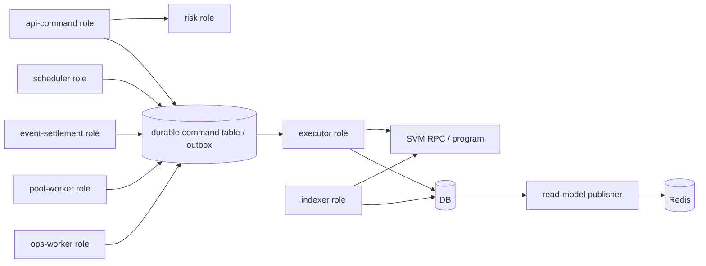

# Keeper Role-Based Extraction With Durable Commands Plan

Status: Draft implementation plan
Date: 2026-05-15
Owner: Trade system architecture
Scope: `surfv2-dex-svm-keeper` role extraction, durable command/outbox model, idempotency, leases, scanner/executor split, risk split, and migration path for perpetual DEX plus event-contract/prediction flows.

## Goal

Move the current keeper from a stateful all-in-one service toward role-based runtimes backed by durable commands, so API traffic can scale independently, singleton jobs are protected by leases, chain execution is replay-safe, and product domains can be decoupled without breaking current external APIs.

## Design Choice

We will use role-based extraction with durable commands:

- Keep the current repo and public APIs stable at first.
- Introduce explicit runtime roles inside the same codebase before splitting repositories.
- Persist write intents as durable commands with idempotency keys, owner shards, retry state, and chain tx metadata.
- Add leases for singleton loops before enabling extra replicas.
- Extract low-risk roles first, then executor/indexer, then event-contract settlement.

This is the recommended middle path between a file-only cleanup and a big-bang microservice rewrite.

## Constraints From Current Investigation

- API edge should become stateless. `cex-api-service` already routes SVM/perp and prediction traffic to keeper endpoints, so backend refactor must preserve those endpoint contracts.
- Match engine is not the immediate bottleneck according to current notes; it already uses shards/channels and has not shown blocking as the first concern.
- Scheduler jobs need real-time classification. Funding fee, liquidation, position scanning, stats, reward, notices, and pool snapshots should not all share one runtime fate.
- Liquidation should evolve from periodic scanning toward event/price-triggered processing, but it can keep a single active owner during early phases.
- Chain subscription/scanning should become an independent scan/index role, with primary/standby or sharded ownership.
- Data push to frontend should move through Redis/read-model publication rather than in-process WebSocket assumptions.
- Risk control is a strong early split candidate. Current order flow has wait/latency budget around the order path; risk checks should be parallelizable where possible.
- Product lines should be separated by ownership: perpetual DEX, event contracts, and future prediction market share patterns, but should not share all runtime state.
- Contract logic is similar across product lines, but product settlement and risk ownership should be independent.

## Target Roles

| Role | Runs HTTP? | Owns singleton loops? | State owner | First extraction target |
| --- | --- | --- | --- | --- |
| `api-command` | Yes | No | No local order book ownership | Existing `/account`, `/pool`, `/system` command intake |
| `risk` | Optional internal HTTP/RPC | No, except config refresh with cache | Risk config snapshot by product/pair | Order validation, event/prediction risk, operational blocks |
| `executor` | No | No global cron | Durable command shard, signer/key shard | Chain submit/retry/finality handling |
| `indexer` | No | Yes, via chain cursor lease | Chain cursor/topic/account shard | SVM scan, parse, compensation trigger |
| `scheduler` | No | Yes, via job lease | Job shard by pair/account/pool | Funding fee, liquidation, pair sync, config refresh |
| `event-settlement` | No | Yes, via settlement lease | Market/time bucket/account shard | Prediction/event settlement queues |
| `pool-worker` | No | Yes, via pool lease | Pool ID shard | LP price, pool snapshots, pool asset checks |
| `ops-worker` | No | Yes, via job/account lease | Account/campaign shard | Voucher, DreamFund, reward, notices, stats |
| `read-model-publisher` | Optional WS/Redis | No global trading authority | Topic/account shard | Redis streams, frontend push events |

## Durable Command Model

Durable commands should represent "intent to mutate trading or chain state". They should not replace all DB tables. They should create a reliable boundary between stateless command intake and stateful workers.

### Initial Command Types

| Command type | Producer | First worker owner | Idempotency key |
| --- | --- | --- | --- |
| `ORDER_CREATE` | `api-command` | `executor` or current keeper path during shadow phase | `account_id:client_order_id` or `account_id:request_id:order_side` |
| `ORDER_CANCEL` | `api-command` | `executor` | `account_id:order_id:cancel` |
| `ORDER_UPDATE` | `api-command` / `indexer` compensation | `executor` | `account_id:order_id:update:version` |
| `ORDER_EXECUTE` | matcher/scheduler/risk | `executor` | `order_id:exec_type:trigger_seq` |
| `LIQUIDATION_EXECUTE` | `scheduler` / future risk trigger | `executor` | `position_id:liquidation:price_epoch` |
| `FUNDING_FEE_SETTLE` | `scheduler` | `executor` | `pair_id:funding_window` |
| `POOL_LIQUIDITY` | `api-command` / `pool-worker` | `executor` / `pool-worker` | `pool_id:account_id:op:request_id` |
| `PREDICT_OPEN` | `api-command` | `event-settlement` / `executor` | `account_id:market_id:duration:request_id` |
| `PREDICT_SETTLE` | `event-settlement` | `executor` | `predict_order_id:settle` |
| `COMPENSATE_CHAIN_EVENT` | admin/indexer | `indexer` | `chain_id:slot_or_tx_hash:topic` |
| `OPS_NOTICE_REWARD` | scanner/ops | `ops-worker` | `account_id:notice_or_reward_type:source_id` |

### Command Fields

Minimum command record:

| Field | Purpose |
| --- | --- |
| `id` | Internal durable command ID |
| `command_type` | One of the command types above |
| `idempotency_key` | Unique dedupe key per command type |
| `product` | `perp_dex`, `event_contract`, `prediction`, `pool`, `ops` |
| `chain_id` | Chain/runtime partition |
| `account_id` | Account shard when relevant |
| `pair_id` | Pair shard when relevant |
| `pool_id` | Pool shard when relevant |
| `order_id` | Order reference when known |
| `owner_shard` | Deterministic worker shard key |
| `status` | `pending`, `leased`, `submitted`, `confirmed`, `finished`, `failed`, `dead_letter` |
| `attempt_count` | Retry count |
| `next_attempt_at` | Backoff scheduling |
| `lease_owner` | Worker instance currently processing |
| `lease_until` | Lease expiry |
| `tx_hash` | Chain tx hash after submit |
| `last_error` | Last failure summary |
| `payload_json` | Command-specific DTO payload |
| `result_json` | Worker output or final state summary |
| `created_at`, `updated_at` | Audit and recovery |

## Lease Model

Use a DB or Redis lease only after deciding failure semantics per role. Early implementation can use DB row leases for command ownership and Redis/DB leases for singleton jobs.

Lease rules:

- A worker may process a command only if it owns a non-expired lease.
- A worker must heartbeat long-running commands before `lease_until`.
- A lease expiry makes the command eligible for replay.
- Worker handlers must be idempotent because command replay is expected.
- Singleton jobs use stable lease keys such as `keeper:indexer:chain:101`, `keeper:scheduler:funding_fee:pair:1`, or `keeper:pool_worker:pool:25`.
- Leases are scoped by role and shard, not by whole service.

## Architecture Flow

## First Delivery Slice

The first production-safe slice should not change order execution behavior yet. It should add observability and a shadow durable command path.

### Slice 1: Durable Command Shadow Mode

Goal: when current keeper API receives selected write requests, persist a durable command shadow record with idempotency key and payload, but still execute through the existing path.

Candidate routes:

- `/account/create_order`
- `/account/cancel_order`
- `/account/create_pm_order`
- `/pool/add_liquidity`

Success criteria:

- Existing API behavior remains unchanged.
- Duplicate requests produce one active command record by idempotency key.
- Commands record enough payload to replay later.
- Metrics show command creation rate, dedupe count, and failed command writes.
- A feature flag can disable shadow writes instantly.

### Slice 2: Command Worker In Observe-Only Mode

Goal: add a worker that leases pending shadow commands and validates they match current DB/chain state, without mutating state.

Success criteria:

- Worker can acquire/release command leases.
- Worker can mark `observed` or `observe_failed`.
- Worker reports mismatch categories.
- No trading behavior changes.

### Slice 3: Ops Worker Extraction

Goal: use the role flag and lease framework to move low-risk jobs out first.

Candidate modules:

- Voucher notice processing
- Account notices
- Reward/statistic jobs
- DreamFund scheduled jobs, after side effects are inventoried

Success criteria:

- Main keeper can run without these jobs when role flags disable them.
- `ops-worker` can run them with leases.
- Core order execution can deploy separately from campaign/notice changes.

## Implementation Phases

### Phase 0: Inventory And Decision Records

- Create runtime inventory for endpoints, cron jobs, goroutines, channels, global managers, DB tables, Redis keys, sys_config keys, and external callers.
- Create decision record for command store technology: DB table first vs Redis stream vs queue.
- Create decision record for lease store: DB row lease vs Redis `SET NX PX` vs Kubernetes lease.
- Define command status lifecycle and retry/dead-letter policy.

### Phase 1: Role Flags

- Add explicit role configuration, for example `KEEPER_ROLES=api-command,executor,indexer,scheduler,pool-worker,ops-worker,event-settlement`.
- Default role set must preserve current behavior.
- Add startup logging that prints enabled roles and disabled loops.
- Do not split deployments yet.

### Phase 2: Durable Command Store

- Add command entity and repository methods.
- Add idempotent create method.
- Add lease acquisition and heartbeat methods.
- Add command metrics.
- Add shadow writes behind config flag.

### Phase 3: Worker Framework

- Add command worker loop with role/shard filters.
- Add observe-only processors for initial command types.
- Add replay and dead-letter visibility.
- Add tests for duplicate command creation, lease expiry, and worker retry.

### Phase 4: Low-Risk Runtime Split

- Move ops jobs and pool jobs behind role flags and leases.
- Deploy separate role in staging.
- Verify main keeper can disable those roles.
- Move production after dashboards show stable lease ownership and no duplicate job runs.

### Phase 5: Executor And Indexer Split

- Move selected command types from shadow to active worker execution.
- Start with the least risky command type, not all orders.
- Add shadow compare for current path vs worker path.
- Move scanner/indexer to independent role only after cursor lease and compensation tests pass.

### Phase 6: Event Contract And Prediction Split

- Give event/prediction commands separate product namespace and settlement worker.
- Preserve shared chain execution primitives.
- Separate risk/config ownership for event contracts from perpetual DEX.

## Testing And Verification Gates

| Gate | Required evidence |
| --- | --- |
| Shadow command write | Existing route tests pass; command is created once per idempotency key |
| Lease safety | Two workers racing for one command result in one owner |
| Replay safety | Worker crash after lease acquisition allows another worker to resume without duplicate final mutation |
| Feature flag rollback | Shadow writes and workers can be disabled without redeploying code |
| Ops split | Main keeper disabled ops role while separate ops worker runs jobs once |
| Executor split | Duplicate order/settlement execution cannot be produced by retry or worker restart |
| Indexer split | Chain cursor resumes after worker restart and compensation does not double-apply |
| Performance | p95/p99 order latency, scanner lag, command lag, DB/Redis saturation, and tx confirm latency are measured before and after |

## Open Decisions

1. Durable command store: start with DB table for transactional proximity or Redis stream for worker throughput?
2. Lease store: use DB row lease for commands and Redis/Kubernetes for long-running singleton loops, or standardize on one lease mechanism?
3. Idempotency key source: require client request IDs for all trading writes, or derive deterministic keys server-side where missing?
4. Risk split protocol: internal HTTP/RPC service, library role inside same binary, or durable risk-decision command?
5. Liquidation model: keep 500 ms scan with lease first, then add price/event-triggered queues, or move directly to trigger queue?
6. Product split: keep prediction/event contract in keeper repo with separate role, or create a new repo after durable commands are stable?

## Immediate Next Tasks

1. Confirm command store and lease store choices.
2. Build runtime inventory and role matrix from current keeper code.
3. Draft DB schema and repository API for durable commands.
4. Add role flag design with default "all roles" compatibility.
5. Implement shadow command writes for one route, preferably `/account/create_order`.
6. Add observe-only worker and duplicate/lease tests.

## Notes From Current Working Session

- FTP/API layer should be stateless.
- Match engine is not the first refactor target because current notes say sharding/channels have not blocked.
- Timed jobs need high/low realtime classification.
- Liquidation should become more trigger-driven over time, but can remain single-owner early.
- Chain subscription should become a standalone scan service with primary/standby or sharded ownership.
- Data push should prefer Redis/read-model consumption for frontend paths.
- Risk split has near-term value, especially if it can run parallel to existing wait budget.
- Product domains should split ownership across high-leverage/low-leverage, perpetual DEX, event contracts, and future prediction market.
