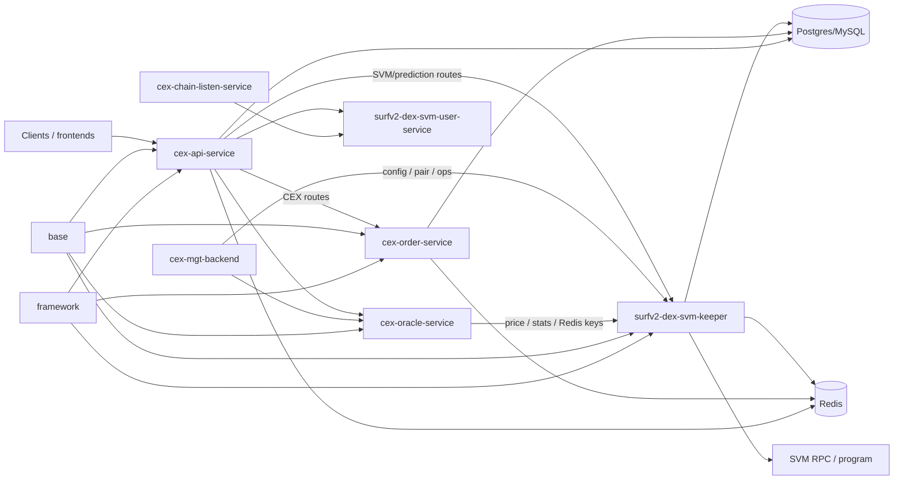
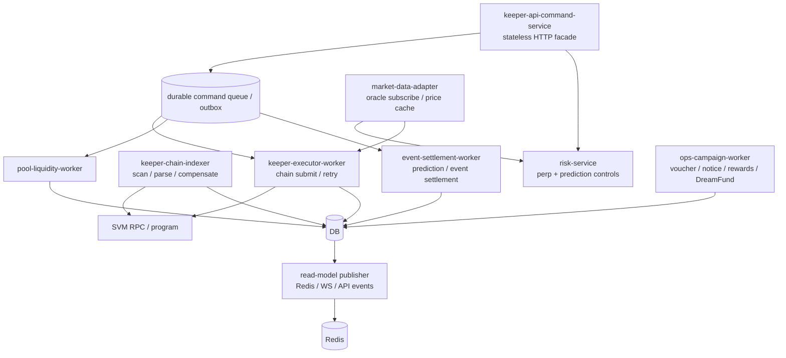

# Keeper Service Architecture Study

Status: Draft architecture assessment
Date: 2026-05-14
Scope: `surfv2-dex-svm-keeper` as the off-chain core for Surf/SVM perpetual DEX, event-contract trading, prediction-market style flows, chain execution, scanning, compensation, pool/liquidity, vouchers, rewards, and operational controls.

## Executive Assessment

The current keeper is not a narrow keeper. It is a deployment monolith that combines public command APIs, order validation, in-memory trigger books, matching, chain execution, SVM scanning/indexing, compensation, oracle subscription, liquidation scheduling, funding fee jobs, pool/liquidity operations, prediction/event-contract settlement, voucher and DreamFund campaigns, account notices, reward/statistic jobs, monitoring, Redis publication, and DB access.

That design was reasonable for MVP speed, but it is now the main scaling and change-management limit. The service contains many stateful singleton components and shared global managers. A small change to risk logic, pool logic, prediction settlement, campaign behavior, scan compensation, or order execution is shipped as one service restart. The restart rebuilds critical in-memory state and can briefly affect unrelated flows.

The highest-risk technical gap is not only code size. The deeper gap is that the runtime ownership model is implicit: there is no explicit partition model, no single-writer contract per account/pair/pool/order shard, no durable command/event boundary between API and workers, and no documented leader/lease strategy for cron, scanner, settlement, and execution loops. Without those contracts, Kubernetes autoscaling can create duplicate actors or divergent in-memory state instead of real capacity.

## Evidence Snapshot

Local repository freshness checked on 2026-05-14:

| Repo | Local state observed | Remote signal |
| --- | --- | --- |
| `Turboflow-HQ` | Clean, aligned with `origin/main` at the time of this report draft | Current documentation target |
| `surfv2-dex-svm-keeper` | `main` behind `origin/main` by 1 commit | Remote changed `go.mod`; product repo was not pulled for this study |
| `cex-api-service` | Behind remote by 15 commits | Used local code plus fetched remote heads as freshness signal |
| `cex-order-service` | Behind remote by 3 commits | Cross-repo role only |
| `cex-oracle-service` | Behind remote by 5 commits | Cross-repo role only |
| `surfv2-dex-svm-user-service` | Behind remote by 1 commit | Cross-repo role only |
| `cex-chain-listen-service` | Behind remote by 7 commits | Cross-repo role only |
| `cex-mgt-backend` | Behind remote by 1 commit | Cross-repo role only |
| `base` | Behind remote by 5 commits | Shared DTO/config/IDL library |
| `framework` | Aligned with remote | Shared infra library |

The assessment below is based on local docs and code artifacts in the workspace, plus fetched remote state awareness. It should be refreshed after product repos are pulled to their target release SHAs.

## Current Runtime Composition

`main.go` creates one `Repositories` instance, one SVM RPC manager, then wires many services into the same process:

| Runtime part | Current responsibility | State profile |
| --- | --- | --- |
| `ApiService` | Order, cancel, remend, quick order, close position, margin, leverage, prediction order, referral, share config | Uses repo, keeper, validator, reward, prediction, voucher |
| `PoolService` | Pool create/close, liquidity, LP price, pool pair, pool swap, scheduled LP/snapshot/status jobs | Global singleton via `InitGlobalPoolService` |
| `KeeperService` | Chain execution queues, executor keys, delayed orders, limit-order checks, funding-fee pool, blockhash cache | Large in-memory queues and worker pools |
| `ScanService` | SVM block/account scanning, event parsing, DB writeback, balance updates, compensation, pair stats | Scanner cursors, channel buffers, LRU tx cache, WS clients |
| `ScheduleService` | Oracle quote subscription, order price processing, liquidation scan, funding fees, referral/rebate jobs, config reload | Quote client, context, price processor, liquidation executor |
| `PredictMarketService` | Prediction/event orders, settlement delay queues, risk snapshots, volatility, configs, WS signal subscription | Per-group delay queues, risk mutex/cache, `sync.Map` caches |
| `VoucherService` / `VoucherNoticeService` | Voucher lifecycle and notice triggering | Lazy-expire channel, DB locks/transactions |
| `DreamFundService` | Campaign reward draw and settlement | Campaign-specific chain/account effects |
| `MonitorService`, `StatisticService`, `RewardService`, `TaskService`, `CompensateService` | Metrics, periodic checks, rewards, async tasks, recovery | Cron jobs, queues, DB/Redis mutation |
| `Repositories` | DB, Redis, stream producers, worker pools, channel buffers, batch insert/publish loops | Shared mutable infra object |

The HTTP router confirms the service exposes account trading, prediction, pool/liquidity, system/admin, compensation, brush-trade, DreamFund, and WebSocket paths from the same deployment.

## Stateful Singletons And Hidden Shared State

The keeper relies on several global in-process managers:

| State holder | What it stores | Scaling concern |
| --- | --- | --- |
| `model.GlobalOrderMgr` | Trigger books, market orders, account order map, active-order map, LRU order cache | Each pod would hold a different local view unless partitioned and replayed |
| `model.GlobalMatcher` | Limit-order book and matched limit-order map | Duplicate pods can double-trigger or diverge without a single writer |
| `model.GlobalPositionMgr` | Active positions, account-position map, closed-position guard map | Restart and multi-pod behavior depends on scan/order timing |
| `model.GlobalCfgMgr` | Pair prices, funding rates, coin/pool/address/user cache | API, scheduler, scanner, and settlement all read mutable config |
| `model.GlobalTradeMgr` | LRU trade cache | Local cache does not scale horizontally by itself |
| `common.EventPusher` | WebSocket broadcast connections and one shared send channel | Pod-local client fanout; no cross-pod topic ownership |
| `PoolService` singleton | Pool operations and pool cron | Singleton hidden behind package global |
| `Repositories` | DB/Redis clients, ants pools, stream producers, and many buffered channels | Shared object couples unrelated domains and shutdown behavior |
| `PredictMarketService` groups | Per-account modulo delay queues, risk caches, signal subscription | Partition count is fixed in process; no external ownership contract |

The current model is therefore process-stateful. Some state is recoverable from DB or chain, but it is not stateless in the container sense. Autoscaling the same binary does not automatically increase safe throughput for scanner, scheduler, matcher, settlement, or executor roles.

## Coupling Symptoms

1. Single startup and shutdown path. `main.go` starts API, scheduler, keeper, scanner, prediction market, notices, voucher, stats, rewards, monitor, task, DreamFund, and pool cron as one lifecycle.

2. Shared repository object. `Repositories` owns DB, Redis, worker pools, stream producers, scan cursors, publish channels, batch insert channels, and chain event channels. This object is injected into almost every domain.

3. Globals cross domain boundaries. API, scanner, scheduler, monitor, model helpers, and pool logic all read or write global managers. This makes call graphs shorter, but it removes service boundaries.

4. Admin/system mutation is colocated with trade execution. Routes such as `/system/update_system_config`, `/system/sync_pair_config`, `/system/update_user_positions`, `/system/compensate_events`, and `/system/brush_trade` live beside user trading paths.

5. Campaign modules are in the critical binary. Voucher, DreamFund, referral, notice, reward, and rebate code shares deployment fate with order execution and scanner paths.

6. Prediction/event-contract logic is embedded into the same execution and API service. Prediction order risk windows, signal snapshots, settlement queues, volatility jobs, voucher settlement side effects, and chain settlement actions are inside keeper.

7. Code size concentrates risk. Several files are thousands of lines long: `keeper_execute_service.go`, `api_order_service.go`, `scan_service.go`, `schedule_service.go`, `dreamfund_service.go`, `order_hedge_service.go`, `predict_market_service.go`, and `settlement_helper.go`.

## Cross-Repo Topology

Important edges:

- `cex-api-service` chooses `OrderServiceAddress` or `KeeperServiceAddress` depending on request type. Prediction-market order creation calls keeper directly.
- `base/store` hides service discovery through `sys_config`, including order, keeper, and oracle addresses.
- `base/rpc/keeper_vo.go` calls keeper `/system/sync_pair_config`.
- `cex-mgt-backend` has direct keeper references for trade/admin operations.
- `cex-oracle-service` consumes keeper Redis namespaces for pair stats and position data, and keeper consumes oracle HTTP/WS price data.
- `base/chain/svm_idl` is the visible contract artifact dependency; source contract repo was not visible in the current repo registry.
- Helm config for `surfv2-dex-svm-keeper` production shows `replicaCount: 1`, HPA disabled, port `8010`, metrics `8020`, and 2 CPU / 4 GiB limits. This deployment shape aligns with the code's singleton assumptions.

## Technical Gaps

| Gap                                               | Severity | Why it matters                                                                                                                                                      |
| ------------------------------------------------- | -------- | ------------------------------------------------------------------------------------------------------------------------------------------------------------------- |
| Missing explicit service boundary map             | Critical | Engineers cannot safely know which module owns orders, positions, pool assets, prediction state, notices, rewards, or scanner recovery.                             |
| Missing partition and single-writer model         | Critical | Horizontal scaling requires deterministic ownership by chain, pair, account, pool, order, or task shard.                                                            |
| Missing durable command/event boundary            | Critical | API currently can mutate DB and process-local state directly; workers depend on in-memory queues and cache reconstruction.                                          |
| Missing leader/lease strategy for singleton loops | Critical | Scanner, cron, pool jobs, liquidation, funding fee, prediction settlement, and compensation loops need explicit leader or shard ownership before replica expansion. |
| Missing idempotency register                      | High     | Chain submit, order execute, prediction settle, liquidity, rewards, notices, and compensation need request/task dedupe keys and replay rules.                       |
| Missing runtime config registry                   | High     | Trading behavior depends on `sys_config` and JSON keys spread across keeper, API, oracle, order service, and admin backend.                                         |
| Missing ownership map for DB tables               | High     | Order, fill, position, asset, cashbook, pool, prediction, voucher, and chain event tables are touched by multiple paths.                                            |
| Missing state rebuild contract                    | High     | Restart behavior relies on DB reload, delayed retries, scan repair, and repeated cache sync loops, but no documented RTO/RPO or replay procedure exists.            |
| Missing SLO and capacity baseline                 | High     | There is no visible target for order submit latency, scanner lag, queue depth, liquidation delay, settlement delay, or recovery time.                               |
| Missing test boundaries by domain                 | Medium   | Unit and integration tests cannot target isolated responsibilities while global state and service wiring remain broad.                                              |
| Missing contract source artifact                  | Medium   | Generated SVM IDL is visible; the source contract repo and release artifact chain are not visible in the current registry.                                          |

## Systematic Limits

### 1. Change blast radius

The same binary contains user trading, chain execution, scanning, prediction/event settlement, pool operations, campaign modules, monitoring, and admin ops. A bug fix in voucher notices or a prediction risk patch requires restarting the same process that executes orders and scans chain events.

### 2. Capacity scaling ceiling

More pods would create more API endpoints, but also more schedulers, scanners, matchers, settlement queues, cron jobs, and local caches unless those roles are disabled or partitioned. The current production Helm config uses one replica, which is consistent with this limitation.

### 3. Recovery coupling

The service handles restart recovery by reloading positions, pending orders, limit orders, prediction orders, config, and chain state. During a full restart, unrelated domains share the same recovery window.

### 4. Operational patch accumulation

Risk controls, referral, vouchers, DreamFund, prediction blackout windows, signal blocks, config sync, compensation, and brush-trade operations have become production controls inside the keeper. This increases the chance that urgent operational patches bypass clean domain boundaries.

### 5. Data consistency window

Existing docs already describe DB, memory, and chain state as eventually consistent. That is acceptable for high-throughput systems, but the consistency model needs stronger observability, idempotency, and replay tooling as traffic grows.

### 6. Ownership friction

Different teams or owners working on event contracts, perpetual execution, pool liquidity, risk, campaigns, scanner reliability, and admin controls all modify one codebase and one deployment. This slows review and raises merge and release risk.

## Bottleneck Hypotheses

These are architecture risks that should be verified with metrics and load tests:

| Bottleneck | Current evidence | What to measure |
| --- | --- | --- |
| In-process order and matcher locks | `GlobalOrderMgr` and `GlobalMatcher` use coarse locks around maps/order books | Lock wait time, trigger loop duration, pair-level order count |
| Scanner queue pressure | `ScanService` uses 5k/20k channel buffers and serial block parse ordering | Scanner lag, block parse time, channel depth, event write latency |
| Shared DB writer pressure | Repo batch insert loops and many services share one DB client | DB QPS, slow queries, lock waits, transaction conflicts |
| Redis fanout and streams | Repo publishes trade changes, slippage price, vol, and WebSocket events | Redis stream lag, publish errors, dropped messages |
| Chain RPC and signer throughput | Keeper executes chain tasks through executor keys and RPC manager | tx submit latency, confirm latency, RPC error rate, signer/key saturation |
| Cron overlap | Prediction risk job comments note cron can overlap without mutex | job duration vs schedule interval, skipped/overlapped executions |
| Restart rebuild time | Multiple services reload pending state and repeat reload loops after start | recovery time, stale cache duration, unmatched pending task count |
| Single deployment resource limit | Production values show 1 replica, 2 CPU/4 GiB limit, HPA disabled | CPU, heap, GC pause, queue depth, p99 submit/settle latency |

## Target Architecture Direction

The goal should not be a big-bang microservice rewrite. The target should be explicit runtime roles with durable boundaries, while preserving the current DB and chain state machine during migration.

Recommended service roles:

| Target role | First extraction boundary | Scaling model |
| --- | --- | --- |
| `keeper-api-command-service` | HTTP routes, validation, idempotency key creation, durable command enqueue | Stateless; scale by HTTP load |
| `keeper-executor-worker` | Chain task submission, retries, signer/key pools, blockhash cache | Partition by chain and task shard; one owner per task |
| `keeper-chain-indexer` | SVM block/account scan, event parse, compensation, chain cursor | Partition by chain/account/program topic; lease-based ownership |
| `keeper-market-data-adapter` | Oracle WS subscription, price cache publication, stale-price health | Scale by pair partition; publish to Redis/event bus |
| `keeper-risk-service` | Perp risk, prediction signal windows, config snapshots, liquidation decisions | Partition by pair/account; pure function where possible |
| `keeper-settlement-worker` | Prediction/event settlement and delayed settlement queues | Partition by market/account/time bucket |
| `keeper-pool-worker` | Pool/liquidity scheduled jobs and pool asset reconciliation | Partition by pool ID |
| `keeper-ops-worker` | Voucher, notices, DreamFund, rewards, rebates, stats | Partition by account/campaign; separate release cadence |
| `read-model-publisher` | Redis streams, WebSocket event publication, materialized views | Scale by topic/account shard |

## Migration Strategy

### Phase 0: Stabilize the current monolith

- Document all runtime roles, sys_config keys, cron jobs, DB tables, Redis keys, and endpoints by owner.
- Add metrics for queue depth, scanner lag, chain submit/confirm latency, order trigger latency, prediction settlement lag, config reload errors, and recovery duration.
- Add idempotency keys to command entry points and chain tasks before splitting workers.
- Add health checks that include scanner lag, oracle freshness, DB/Redis health, and queue saturation, not only HTTP process health.
- Gate operational endpoints with explicit owner and audit logs.

### Phase 1: Modularize inside the same repo

- Introduce internal interfaces around order store, position store, price provider, chain executor, scanner event sink, risk evaluator, and notification publisher.
- Move global managers behind role-specific state stores. Keep current implementations, but stop exposing package globals to new code.
- Split `api_order_service.go`, `keeper_execute_service.go`, `scan_service.go`, and `schedule_service.go` by domain responsibilities.
- Build domain tests that can reset state without booting the full process.

### Phase 2: Separate non-critical roles first

- Extract voucher notice, DreamFund, reward/statistic, and account notice jobs into an ops worker or at least a separately enabled runtime mode.
- Keep DB schema and APIs unchanged while moving jobs out of the order execution process.
- This reduces release blast radius quickly without changing the trading state machine.

### Phase 3: Externalize durable commands and worker ownership

- Add a command/outbox table or queue for order create/update/execute, liquidity, prediction open/settle, compensation, and admin sync actions.
- Assign each command an idempotency key, owner shard, status, retry policy, and replay rule.
- Add leases for singleton loops. Start with scanner and settlement workers, then liquidation/funding jobs.

### Phase 4: Split execution and indexer

- Run chain execution as workers reading durable commands.
- Run scanner/indexer as an independently deployable service with explicit chain cursor ownership.
- API becomes stateless for command intake. It no longer relies on local order books to accept a request.

### Phase 5: Product-vertical separation

- Split prediction/event-contract settlement and risk into their own vertical once durable command and state boundaries exist.
- Keep shared libraries in `base` only for DTOs, enums, and generated contract artifacts; avoid putting runtime behavior into shared packages.

## Near-Term 30/60/90 Day Plan

30 days:

- Produce a keeper runtime inventory: endpoints, cron jobs, goroutines, channels, global managers, DB tables, Redis keys, sys_config keys, and external callers.
- Add or expose operational metrics for scanner lag, chain tx lifecycle, queue depths, cache rebuild time, and prediction settlement lag.
- Create an ownership matrix for perpetual DEX, prediction/event, pool, risk, scanner, campaign, and admin/config domains.
- Add a release checklist that flags whether a change touches execution, scanner, risk, campaign, or admin mutation paths.

60 days:

- Add idempotency and command status records for high-risk actions: create order, execute order, cancel/update order, prediction open/settle, liquidity, compensation.
- Add leader/lease protection to cron/scanner/settlement loops before any replica count increase.
- Extract voucher/DreamFund/reward/notice jobs behind runtime flags or a separate worker binary.
- Add domain-level integration tests for restart recovery and duplicate command replay.

90 days:

- Introduce a stateless command API mode backed by durable commands.
- Run executor and indexer roles as separately deployable workers in staging.
- Define shard keys and ownership rules: `chain_id`, `pair_id`, `pool_id`, `account_id`, `order_id`, and prediction market/time bucket.
- Run load tests at expected DAU growth levels and verify p95/p99 latency, scanner lag, settlement lag, recovery time, and DB/Redis saturation.

## Decision Recommendations

1. Do not enable HPA for the current keeper binary as-is. First define which goroutines are allowed to run in multiple replicas and which require a lease.

2. Treat `surfv2-dex-svm-keeper` as multiple runtime roles, not one service. Start by adding role flags even before physically splitting repos.

3. Prioritize durable command/idempotency work before extraction. Splitting code without replay-safe commands will move the failure mode rather than fix it.

4. Split campaign and notification jobs before splitting chain execution. That gives fast blast-radius reduction with lower protocol risk.

5. Keep the first major architecture milestone at "stateless API plus stateful workers with leases", not full microservices. That is the practical step that unlocks autoscaling safely.

6. Make prediction/event-contract trading a first-class domain before adding prediction market expansion. It needs its own state machine, risk config registry, settlement ownership, and replay tests.

## Open Questions

- What are current production DAU, peak orders per second, open orders by pair, active positions, scanner lag, and prediction order volume?
- Which DB engine is the production keeper using for these tables, and what are current lock/slow-query profiles?
- Are there hidden deployment flags that disable scanner/scheduler roles in extra replicas?
- Where is the canonical SVM contract source and release artifact registry?
- Which team owns event-contract settlement vs perpetual execution vs campaign modules?
- Which operational endpoints are externally reachable or only cluster-internal?
- What is the acceptable RTO/RPO for keeper restart and chain scanner recovery?

## Bottom Line

The keeper's current architecture is a high-function MVP monolith. The main technical debt is not that many functions exist in one repo; it is that state ownership, execution ownership, and recovery ownership are implicit. The upgrade path should make those contracts explicit first, then split runtime roles in the order that reduces blast radius without changing the trading state machine prematurely.
