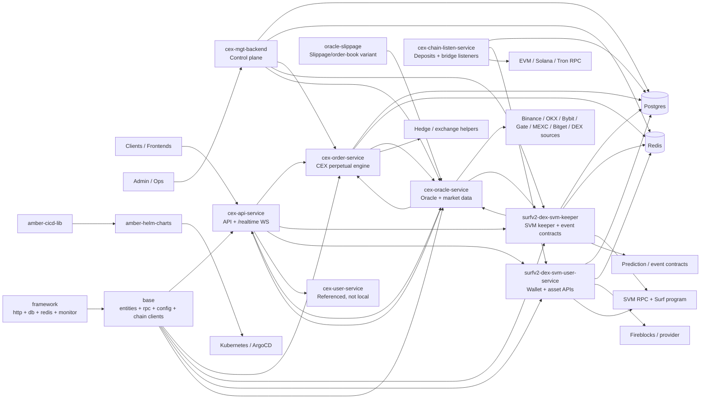

# Trading Engine Architecture Brief

Status: Draft
Date: 2026-05-14
Source snapshot: `Turboflow-HQ` `fbdf588` on `main`, plus current local product repos listed in `ops/repo-index.json`.
Scope: trading engine, keepers, order APIs, market data, user assets, runtime config, and deployment surface currently visible in the Turboflow workspace.

## Executive Summary

Turboflow currently exposes one public API edge over two main trading execution paths:

- CEX/perpetual trading is centered on `cex-order-service`. It owns off-chain orders, fills, positions, pools, matching, risk, leverage, hedging, schedulers, rewards, and statistics.
- Surf v2 SVM / contract-backed trading is centered on `surfv2-dex-svm-keeper`. It owns chain-backed order and pool operations, keeper execution, chain scanning, compensation, prediction/event-contract order logic, and SVM state transitions.

Both paths depend on `cex-oracle-service` for market data, `base` and `framework` for shared contracts/runtime helpers, Redis/Postgres for state and config, and Helm charts for deployment. The system is operationally broad, but several important runtime services are referenced by deployment charts and API routing without visible local source code.

## Architecture Diagram

## Part Status

| Part | Primary repos | Current status | Notes |
|------|------|------|------|
| Public API and WebSocket edge | `cex-api-service` | Implemented, broad surface | Routes account, order, position, wallet, asset, pool, market, task, activity, inbox, and WebSocket traffic. Acts mostly as facade over order, user, keeper, and oracle services. |
| CEX perpetual engine | `cex-order-service` | Implemented, needs lifecycle trace | Contains order, pool, matcher, scheduler, risk, leverage, PM/RM, hedging, reward, and statistics services. Active router is narrower than the service layer, so call paths need mapping through `base/rpc` and API handlers. |
| Surf/SVM keeper | `surfv2-dex-svm-keeper` | Implemented, high criticality | Owns SVM-backed order/pool execution, chain status transitions, scanner, compensation, trigger/stop orders, prediction/event-contract orders, and risk publication. |
| Prediction/event contracts | `surfv2-dex-svm-keeper`, `base/chain/svm_idl` | Partially documented | Code exists for prediction orders, band risk, signal blocking, blackout windows, oracle staleness, and slippage checks. Contract source repo is not visible; generated IDL is the visible artifact. |
| User asset and wallet plane | `surfv2-dex-svm-user-service`, `cex-chain-listen-service`, `turboflow-fireblocks-sdk-go` | Implemented, source split across services | Handles wallets, token approvals, assets, withdraws, internal transfers, Fireblocks/provider callbacks, deposits, and bridge/listen flows. CEX-side `cex-user-service` is referenced but not locally visible. |
| Oracle and market data | `cex-oracle-service`, `oracle-slippage` | Implemented, ownership needs reconciliation | Oracle ingests exchange/DEX market data and exposes price/kline APIs and WebSockets. `oracle-slippage` appears to overlap or specialize in slippage/order-book logic. |
| Admin/control plane | `cex-mgt-backend` | Implemented, mapping incomplete | Provides pair, finance, risk, rule, sys config, user, trade, monitor, collection, and swap administration. Exact field-to-runtime-config ownership is not centrally mapped. |
| Shared foundation | `base`, `framework` | Implemented, central coupling point | Shared entities, enums, RPC DTOs/clients, DB/Redis/config helpers, chain clients, HTTP/WebSocket/runtime utilities. Changes here can affect most services. |
| Delivery platform | `amber-helm-charts`, `amber-cicd-lib` | Implemented, larger than code checkout | Helm app list includes cloned services plus several services not present locally, including `cex-user-service`, `wallet-service`, `quote-service`, `sign-service`, `settlement-service`, and frontends. |

## Key Trade Flows

| Flow | Current path | Status |
|------|------|------|
| CEX perpetual order | Client -> `cex-api-service` -> `cex-order-service` -> Postgres/Redis -> matcher/scheduler/risk/hedge -> API/WebSocket updates | Implemented, needs end-to-end trace. |
| Surf/SVM order | Client -> `cex-api-service` -> `surfv2-dex-svm-keeper` -> SVM RPC/program -> scanner/compensation -> DB/asset effects | Implemented, chain state machine needs dedicated documentation. |
| Prediction/event-contract order | Client/API -> keeper prediction endpoint -> oracle freshness/slippage checks -> prediction risk/blocking -> order/settlement execution | Partially documented, high-risk path. |
| Market data distribution | Exchanges/DEX sources -> `cex-oracle-service` -> Redis/DB/WebSocket/HTTP -> API, order service, keeper | Implemented, likely central bottleneck. |
| Deposit/withdraw/asset | Chain listeners + DEX user service + Fireblocks/provider callbacks -> DB/Redis/assets/cashbooks | Implemented, split ownership and missing CEX-user source are key gaps. |
| Admin configuration | `cex-mgt-backend` and service system endpoints -> `sys_config` / `trade_config` -> service caches and runtime behavior | Implemented, but canonical config register is missing. |

## Gaps And Potential Issues

| Severity | Area | Gap / issue | Why it matters |
|------|------|------|------|
| High | Missing source repos | Runtime charts and API routes reference services not visible locally, especially `cex-user-service`. | Account, CEX user asset, auth, and some wallet flows cannot be fully audited from current source. |
| High | Service contracts | Service-to-service contracts are implicit in `base/rpc`, route handlers, and DB config. | Changes can break runtime integration without a central API contract map. |
| High | Runtime config governance | Trading behavior depends on `sys_config` / `trade_config` JSON values not captured as canonical production config. | Risk, order, oracle, and keeper behavior may differ from docs and code defaults. |
| High | Prediction/event-contract lifecycle | Keeper code exists, but contract source, settlement state machine, and asset effects need a dedicated trace. | This is a high-risk trading path because oracle staleness, slippage, risk blocking, and settlement all interact. |
| High | CEX order lifecycle | `cex-order-service` has a large service surface and some routes are commented while API/RPC paths still exist. | It is hard to verify order acceptance, fill, position, liquidation, and client update behavior end to end. |
| Medium | Oracle/slippage overlap | `cex-oracle-service` and `oracle-slippage` share structure and responsibilities. | Duplicate or divergent slippage logic can produce inconsistent risk and pricing behavior. |
| Medium | WebSocket ownership | API, oracle, order, and keeper all expose WebSocket/event paths without a central topic/payload registry. | Client-facing real-time behavior is hard to validate and can drift between producers and consumers. |
| Medium | Data model ownership | Order/fill/position/pool/asset/cashbook tables are split across READMEs, models, DAOs, and migrations. | Data consistency and recovery logic are difficult to reason about without an ownership map. |
| Medium | Deployment map | Helm app inventory is broader than visible code repos and per-service ports/health/metrics are not centrally extracted. | Operational readiness and incident response are harder than necessary. |

## Likely Bottlenecks

| Bottleneck | Current signal | Potential impact |
|------|------|------|
| Oracle service fan-out | API, order service, and keeper all depend on oracle price/kline/ticker data. | Oracle latency, stale ticks, or bad slippage data can block or misprice both CEX and event-contract trading. |
| Shared Redis/Postgres | Most services use shared DB/Redis for order state, config, price caches, and asset records. | DB/Redis contention or inconsistent cache invalidation can affect trading, risk checks, and balances. |
| `base` coupling | Most services import shared entities, enums, RPC DTOs, config, and chain helpers from `base`. | Cross-repo changes can have a wide blast radius and need coordinated versioning/testing. |
| Keeper chain dependency | SVM keeper relies on RPC, program/IDL compatibility, scanner, and compensation. | Chain RPC degradation or IDL/program mismatch can leave orders in intermediate chain statuses. |
| Runtime config opacity | Many behavior switches are DB-backed and not versioned with code. | Incidents can be hard to reproduce from Git alone. |
| Missing runtime repos | Helm references services outside the local code index. | Full architecture, security, and reliability review is incomplete until those services are indexed. |

## Recommended Next Actions

1. Build `service-contracts.md`: inventory `base/rpc` clients, HTTP routes, ports, and runtime URLs.
2. Build `config-key-register.md`: inventory `sys_config` and `trade_config` keys, owners, defaults, consumers, and admin fields.
3. Trace `cex-order-lifecycle.md`: API request through CEX risk, DB writes, matcher, fills, positions, and client updates.
4. Trace `svm-keeper-lifecycle.md`: API request through keeper, SVM submit/confirm/finish, scanner, compensation, and asset effects.
5. Trace `prediction-event-contracts.md`: oracle checks, slippage, signal/band risk, settlement lifecycle, and contract artifacts.
6. Map missing Helm apps to source repos or mark them external/runtime-only.
