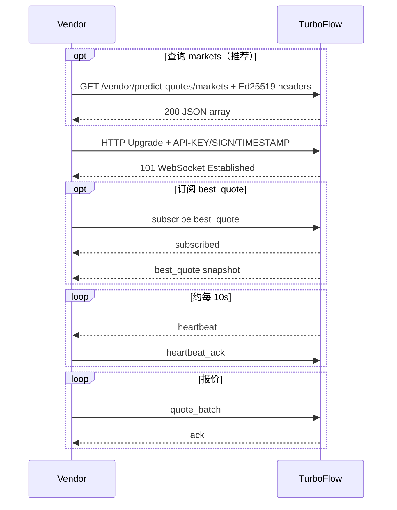

# 事件合约赔率报价接口 v2.2

| 项 | 内容 |
| --- | --- |
| 文档版本 | v2.2 |
| 最后更新 | 2026-06-03 |
| 面向读者 | **外部赔率 Vendor** 技术对接人员 |
| 协议版本 | Phase 1 |
| 服务提供方 | TurboFlow |
| 英文版本 | API文档 - 多vendor流动性路由方案 v2.2 EN.md |

---

## 目录

1. [概览](#1-概览)
2. [连接与鉴权](#2-连接与鉴权)
3. [通用约定](#3-通用约定)
4. [支持的市场](#4-支持的市场)
5. [消息协议](#5-消息协议)
6. [对接时序](#6-对接时序)
7. [错误码与限流](#7-错误码与限流)
8. [对接检查清单](#8-对接检查清单)
9. [附录](#9-附录)

---

## 1. 概览

### 1.1 TurboFlow 提供什么

TurboFlow 暴露 **inbound WebSocket** 端点。Vendor 按 predict market 推送 up/down 赔率（`return_rate`）。平台聚合多家 Vendor 报价，并选择最优价格用于展示与订单路由。

### 1.2 Vendor 需要做什么

| 能力 | 说明 |
| --- | --- |
| 建立 WebSocket | 使用 TurboFlow 下发的 Ed25519 `API-KEY / SIGN / TIMESTAMP` 方式完成鉴权。 |
| 查询 allowed markets（可选） | 连接前调用 `GET /vendor/predict-quotes/markets`。 |
| 持续推送报价 | 发送 `quote_batch`；尽量为每个 market 同时包含 `up` 与 `down`。 |
| 维持连接存活 | 在 30 秒内使用 `heartbeat_ack` 响应服务端 `heartbeat`。 |
| 处理 ack | 根据 `accepted`、`rejected` 与 `errors` 修正数据。 |
| 订阅最优价（可选） | 订阅 `best_quote` 观察平台当前最优赔率（已脱敏）。 |

### 1.3 Vendor 不需要做什么

| 项 | 说明 |
| --- | --- |
| 用户下单 | 用户仍通过现有 App/API 下单；本 WebSocket 不承载交易动作。 |
| 将 `best_quote` 视为成交保证 | `best_quote` 仅供观察；真实订单会在服务端重新执行实时选价。 |
| 获取竞争对手信息 | `best_quote` 永远不会暴露 winning vendor id、quote id、second-best price 或竞争对手明细。 |

### 1.4 环境与端点

TurboFlow 对 WebSocket 与 HTTP 暴露**同一个公网 API host**（`{api_host}`）。Path 固定。

| 能力 | Path | 说明 |
| --- | --- | --- |
| WebSocket 报价 | `/ws/vendor/predict-quotes` | 连接、`quote_batch`、heartbeat、`best_quote`。 |
| HTTP allowed markets | `/vendor/predict-quotes/markets` | `GET`，与 WebSocket 使用相同鉴权；可选的连接前查询。 |

完整 URL 格式：

| 能力 | URL |
| --- | --- |
| WebSocket | `wss://{api_host}/ws/vendor/predict-quotes` |
| HTTP allowed markets | `https://{api_host}/vendor/predict-quotes/markets` |

#### 各环境 API host

| 环境 | `{api_host}` | WebSocket | HTTP allowed markets |
| --- | --- | --- | --- |
| **UAT** | `api.turboflow-test.xyz` | `wss://api.turboflow-test.xyz/ws/vendor/predict-quotes` | `https://api.turboflow-test.xyz/vendor/predict-quotes/markets` |
| **Production** | 由运维下发 | `wss://{prod_api_host}/ws/vendor/predict-quotes` | `https://{prod_api_host}/vendor/predict-quotes/markets` |

TurboFlow 按环境提供公钥 API key、私钥种子交付渠道和 `allowed_markets`。

---

## 2. 连接与鉴权

### 2.1 协议要求

| 项 | 值 |
| --- | --- |
| 传输 | WebSocket over `wss://`。 |
| 帧类型 | JSON **文本帧**，UTF-8；Phase 1 不使用 binary。 |
| 子协议 | 无。 |

### 2.2 HTTP Upgrade Headers

鉴权方式升级为 TurboFlow API 鉴权方式：

`https://devdoc-3.gitbook.io/devdoc-docs/turboflow-api-doc-1#authentication`

WebSocket upgrade 请求和 HTTP `GET /vendor/predict-quotes/markets` 请求都必须发送以下 headers：

| Header | 类型 | 说明 |
| --- | --- | --- |
| `API-KEY` | string | Vendor Ed25519 公钥，64 字符 hex。TurboFlow 存入 `vendor_api_keys.api_key`。 |
| `SIGN` | string | 本次请求生成的 Ed25519 签名 hex。 |
| `TIMESTAMP` | string | Unix 秒级时间戳，容差 +/- 300 秒。 |

如果 WebSocket 客户端不方便设置 headers，可回退使用同名 query 参数：`api_key`、`sign`、`timestamp`。推荐使用 header 鉴权。

v2.2 接入不再使用旧的 `X-API-KEY / X-API-TS / X-API-SIGN` HMAC 流程。

### 2.3 签名算法

当前 WebSocket 和 allowed-markets 端点：

- Method 固定为 `GET`。
- Body 为空。
- `path` 使用纯 URL 路径，不包含 query 参数。
- 每次连接 / 请求都必须生成新的 `TIMESTAMP` 和 `SIGN`。不得硬编码签名。

签名串：

```text
method=GET&path={path}&timestamp={timestamp}&access-key={apiKey}
```

签名步骤：

1. 构造上面的签名串。
2. 将 hex `API-KEY` 解码为 bytes，并作为 HMAC-SHA256 key。
3. 对签名串做 HMAC-SHA256，得到 digest。
4. 将 Vendor private seed 从 hex 解码，构造 Ed25519 私钥。
5. 用 Ed25519 私钥签名 HMAC digest。
6. 将签名结果 hex 放入 `SIGN`。

Python 示例：

```python
import hashlib
import hmac
import time

from cryptography.hazmat.primitives.asymmetric.ed25519 import Ed25519PrivateKey


API_KEY = "your_64_hex_public_key"
PRIVATE_SEED = "your_64_hex_private_seed"
PATH = "/ws/vendor/predict-quotes"


def sign_request(path: str) -> dict[str, str]:
    timestamp = str(int(time.time()))
    message = f"method=GET&path={path}&timestamp={timestamp}&access-key={API_KEY}"
    digest = hmac.new(bytes.fromhex(API_KEY), message.encode("utf-8"), hashlib.sha256).digest()
    private_key = Ed25519PrivateKey.from_private_bytes(bytes.fromhex(PRIVATE_SEED))
    signature = private_key.sign(digest).hex()
    return {
        "API-KEY": API_KEY,
        "SIGN": signature,
        "TIMESTAMP": timestamp,
    }
```

`GET /vendor/predict-quotes/markets` 使用 path `/vendor/predict-quotes/markets` 签名。WebSocket 使用 path `/ws/vendor/predict-quotes` 签名。

### 2.4 时钟偏差

| 检查点 | 规则 |
| --- | --- |
| 鉴权 header `TIMESTAMP` | `abs(server_now_sec - TIMESTAMP) <= 300`。 |
| `quote_batch.sent_at` | 毫秒 Unix timestamp。TurboFlow 按配置的报价时间偏差窗口校验。 |

鉴权时间戳超出容差会在 WebSocket 建立前返回 **HTTP 401**。`quote_batch.sent_at` 超出容差会在 `ack.errors` 中返回 `CLOCK_SKEW`。

### 2.5 鉴权失败

| 场景 | 行为 |
| --- | --- |
| 签名错误或时间戳偏差 | HTTP **401**，不建立 WebSocket。 |
| Vendor 状态不是 enabled | 拒绝建连或立即断开。 |
| 超过最大并发连接数 | HTTP **429**。 |

### 2.6 并发连接

同一 API key（同一 `vendor_id`）允许多条并发 WebSocket，受 `keeperPredictVendorRegistry` 中的 `max_inbound_connections` 限制。

| 配置 | 含义 |
| --- | --- |
| 省略或 `0` | 默认 **5** 条并发连接。 |
| `1` | 只允许一条 active inbound connection；第二条连接返回 **429**，不会踢掉已有连接。 |
| `N > 1` | 最多 `N` 条并发连接。 |

每条连接有独立 heartbeat、rate limit 和 `best_quote` 订阅。报价共用同一个 vendor quote book；避免跨连接使用冲突的 `vendor_quote_id`。

---

## 3. 通用约定

| 约定 | 说明 |
| --- | --- |
| `type` | 每条 WebSocket 消息必填。 |
| 时间戳 | 消息 payload 中使用毫秒 Unix epoch（`int64`），除非字段明确说明为 Unix 秒。 |
| `return_rate` | 字符串小数，范围 `(0, 1]`，例如 `"0.80"`；TurboFlow 选价前会向零截断到最多 6 位小数。 |
| `market` | `{SYMBOL}-{DURATION}`，例如 `BTC-5m`、`ETH-1h`。 |
| `pair_id` | TurboFlow 事件合约 market id。已知时应携带；`best_quote` 订阅的 `markets[]` 中必填。 |
| `outcome` / `side` | `up` = 看涨，`down` = 看跌。 |
| 幂等 | 单连接内按 `(vendor_id, vendor_quote_id)` 判断：同内容接受；不同内容返回 `DUPLICATE_QUOTE_ID`。 |

### 3.1 报价有效期

| 规则 | 说明 |
| --- | --- |
| 持续有效 | 在有效期内，直到同一 market + side 收到更新报价。 |
| 硬过期 | 默认 **5 分钟**未刷新则不参与选价。 |
| 刷新建议 | 即使价格不变，也至少每 **5 分钟**推送一次完整 `quote_batch`。 |
| 断连 | Heartbeat 超时后，旧报价不参与选价；重连后需要重新推送 `quote_batch`。 |

---

## 4. 支持的市场

### 4.1 市场格式

与 legacy SIG 对齐：

```text
BTC-30s, BTC-1m, BTC-3m, BTC-5m, BTC-15m, BTC-1h
ETH-30s, ETH-1m, ETH-3m, ETH-5m, ETH-15m, ETH-1h
```

| 后缀 | Duration，秒 |
| --- | --- |
| `*-30s` | 30 |
| `*-1m` | 60 |
| `*-3m` | 180 |
| `*-5m` | 300 |
| `*-15m` | 900 |
| `*-1h` | 3600 |

### 4.2 权限范围

Vendor 可推送的市场严格等于 TurboFlow registry 中为该 Vendor 配置的 `allowed_markets`。

重要：空 `allowed_markets` 表示**所有市场都会被拒绝**。接入前请向 TurboFlow 确认列表。

### 4.3 HTTP 查询 allowed markets

打开 WebSocket 前，可查询当前 API key 对应的 allowed markets。

| 项 | 值 |
| --- | --- |
| Method / path | `GET /vendor/predict-quotes/markets` |
| Base host | 与 1.4 的 `{api_host}` 相同。 |
| 鉴权 | 与 2 节相同的 `API-KEY / SIGN / TIMESTAMP` 鉴权。 |
| 成功 | HTTP **200**，body 是 JSON array，无 wrapper。 |
| 无启用市场 | HTTP **200**，`[]`。 |
| 鉴权失败 | HTTP **401**。 |
| 服务不可用 | HTTP **502** / **503**，临时错误，短暂重试。 |

响应示例：

```json
[
  {
    "pair_id": 5,
    "market": "BTC-30s",
    "symbol": "BTC",
    "interval_in_seconds": 30
  },
  {
    "pair_id": 5,
    "market": "BTC-5m",
    "symbol": "BTC",
    "interval_in_seconds": 300
  }
]
```

| 字段 | 类型 | 说明 |
| --- | --- | --- |
| `pair_id` | int64 | TurboFlow 事件合约 market id。 |
| `market` | string | 与 `quote_batch.market` 相同，例如 `BTC-5m`。 |
| `symbol` | string | 标的符号，例如 `BTC`。 |
| `interval_in_seconds` | int64 | 周期秒数。 |

Python 请求示例：

```python
import requests

headers = sign_request("/vendor/predict-quotes/markets")
response = requests.get(
    "https://api.turboflow-test.xyz/vendor/predict-quotes/markets",
    headers=headers,
    timeout=10,
)
response.raise_for_status()
print(response.json())
```

---

## 5. 消息协议

### 5.1 消息类型

| 方向 | `type` | 说明 |
| --- | --- | --- |
| Vendor -> Server | `hello` | 可选能力声明。 |
| Vendor -> Server | `quote_batch` | 核心批量报价推送。 |
| Vendor -> Server | `subscribe` | 订阅 `best_quote`。 |
| Vendor -> Server | `unsubscribe` | 取消订阅 `best_quote`。 |
| Vendor -> Server | `heartbeat_ack` | 心跳响应。 |
| Server -> Vendor | `ack` | `quote_batch` 处理结果。 |
| Server -> Vendor | `subscribed` | 订阅确认。 |
| Server -> Vendor | `best_quote` | 脱敏最优报价推送。 |
| Server -> Vendor | `heartbeat` | 心跳探测。 |
| Server -> Vendor | `error` | 错误帧，例如订阅被拒绝。 |

### 5.2 Vendor -> Server 消息示例

#### (1) `hello`，可选

```json
{
  "type": "hello",
  "client_ts": 1757908892351,
  "markets": ["BTC-5m", "ETH-3m"]
}
```

#### (2) `quote_batch`，核心报价推送

```json
{
  "type": "quote_batch",
  "vendor_quote_id": "vendor-1757908892351-001",
  "sent_at": 1757908892351,
  "quotes": [
    {
      "pair_id": 5,
      "market": "BTC-5m",
      "outcomes": [
        {
          "outcome": "up",
          "return_rate": "0.80"
        },
        {
          "outcome": "down",
          "return_rate": "0.79"
        }
      ]
    }
  ]
}
```

#### (3) `subscribe`，获取 best_quote 的请求

使用该消息请求当前及后续脱敏最优报价。

```json
{
  "type": "subscribe",
  "topic": "best_quote",
  "markets": [
    {
      "pair_id": 5,
      "market": "BTC-5m"
    }
  ],
  "sides": ["up", "down"]
}
```

`markets[]` 使用对象数组，不是字符串数组。每个对象必须同时标识 `pair_id` 与 `market`，避免歧义。

#### (4) `unsubscribe`

```json
{
  "type": "unsubscribe",
  "topic": "best_quote",
  "markets": [
    {
      "pair_id": 5,
      "market": "BTC-5m"
    }
  ],
  "sides": ["up"]
}
```

#### (5) `heartbeat_ack`

```json
{
  "type": "heartbeat_ack",
  "server_ts": 1757908892399,
  "client_ts": 1757908892405
}
```

### 5.3 Server -> Vendor 消息示例

#### (1) `ack`，全部接受

```json
{
  "type": "ack",
  "vendor_quote_id": "vendor-1757908892351-001",
  "accepted": 2,
  "rejected": 0,
  "server_ts": 1757908892399
}
```

#### (2) `ack`，部分拒绝

```json
{
  "type": "ack",
  "vendor_quote_id": "vendor-1757908892351-002",
  "accepted": 1,
  "rejected": 1,
  "server_ts": 1757908892399,
  "errors": [
    {
      "market": "BTC-5m",
      "outcome": "down",
      "code": "QUOTE_OUT_OF_RANGE",
      "message": "return_rate must be in (0, 1]"
    }
  ]
}
```

#### (3) `subscribed`

```json
{
  "type": "subscribed",
  "topic": "best_quote",
  "markets": [
    {
      "pair_id": 5,
      "market": "BTC-5m"
    }
  ],
  "sides": ["up", "down"],
  "server_ts": 1757908892399
}
```

#### (4) `best_quote`，有效 snapshot / update

```json
{
  "type": "best_quote",
  "event": "snapshot",
  "pair_id": 5,
  "market": "BTC-5m",
  "side": "up",
  "status": "valid",
  "return_rate": "0.80",
  "quote_ts": 1757908892351,
  "selected_at": 1757908892399,
  "quote_age_ms": 48,
  "routing_strategy": "best_return_rate"
}
```

#### (5) `best_quote`，无有效报价

```json
{
  "type": "best_quote",
  "event": "update",
  "pair_id": 5,
  "market": "BTC-5m",
  "side": "up",
  "status": "no_valid_quote",
  "reason": "all_quotes_expired_or_unavailable",
  "selected_at": 1757908894399
}
```

#### (6) `heartbeat`

```json
{
  "type": "heartbeat",
  "server_ts": 1757908892399
}
```

#### (7) `error`

```json
{
  "type": "error",
  "code": "SUBSCRIPTION_DENIED",
  "message": "vendor is not allowed to subscribe to best_quote",
  "server_ts": 1757908892399
}
```

### 5.4 Heartbeat 规则

| 参数 | ms | 说明 |
| --- | --- | --- |
| `heartbeat_interval_ms` | 10000 | 服务端约每 10 秒发送 `heartbeat`。 |
| `heartbeat_timeout_ms` | 30000 | 30 秒内未收到 `heartbeat_ack` 则断连。 |

### 5.5 best_quote 隐私与语义

`best_quote` 永远不包含：

- `winning_vendor_id`
- `vendor_id`
- `pool_id`
- `quote_id`
- `is_own_quote`
- `second_best_quote`
- 任何竞争对手身份或报价深度。

重要：`best_quote` **不是**成交保证。用户下单时会重新执行选价。

---

## 6. 对接时序



---

## 7. 错误码与限流

### 7.1 `ack.errors` code

| code | 说明 | 建议处理 |
| --- | --- | --- |
| `QUOTE_OUT_OF_RANGE` | `return_rate` 不在 `(0, 1]`。 | 修正赔率。 |
| `MARKET_INVALID` | Market 无法解析 / 未配置。 | 检查 market 字符串。 |
| `MARKET_NOT_ALLOWED` | 不在 `allowed_markets`。 | 联系 TurboFlow。 |
| `CLOCK_SKEW` | `sent_at` 超出时间偏差窗口。 | 同步 NTP 后重发。 |
| `DUPLICATE_QUOTE_ID` | 同一 `vendor_quote_id` 内容不同。 | 换新 ID 或保持内容一致。 |
| `MISSING_OUTCOME` | `outcomes` 为空。 | 增加 `up` / `down`。 |
| `POOL_NOT_CONFIGURED` | Vendor pool 未配置。 | 联系 TurboFlow。 |
| `RATE_LIMITED` | 超出限流。 | 降速后重试。 |

### 7.2 连接级错误

| 场景 | 行为 |
| --- | --- |
| 鉴权失败 | HTTP **401**。 |
| Vendor disabled | 断开连接。 |
| Reject 比例过高 | 1 分钟内 reject 超过 30% -> 断连。 |
| Heartbeat 超时 | 断连；报价失效。 |
| 推送过快 | 每连接每秒超过 20 个 `quote_batch` -> 限流或断连。 |

断连后需要重新连接并重新推送 `quote_batch`。

### 7.3 限制

| 规则 | 阈值 |
| --- | --- |
| `quote_batch` 频率 | 每连接每秒 <= 20。 |
| Batch 大小 | <= 24 个 markets，每个 market <= 2 个 outcomes。 |
| Reject 断连 | 1 分钟内超过 30%。 |
| Heartbeat 超时 | 30 秒无 `heartbeat_ack`。 |

---

## 8. 对接检查清单

- 已实现 Ed25519 `API-KEY / SIGN / TIMESTAMP` 鉴权。
- 每次请求 / 连接都生成新的 `TIMESTAMP` 和 `SIGN`；不硬编码签名。
- 推荐连接前调用 `GET /vendor/predict-quotes/markets` 校验 `allowed_markets`。
- 已实现 `quote_batch`；至少每 5 分钟刷新一次。
- `best_quote` 的 `subscribe` / `unsubscribe` 使用带 `pair_id` 与 `market` 的 `markets[]` 对象数组。
- 已处理 `ack` / `errors`。
- 30 秒内完成 `heartbeat` -> `heartbeat_ack`。
- 断连后重连并重新推送报价。
- 可选 `best_quote` 订阅已理解为非成交承诺。
- UAT 覆盖多 market、up/down、重连、时钟偏差、部分 reject 和订阅行为。

---

## 9. 附录

### 9.1 联系方式

| 事项 | 联系方 |
| --- | --- |
| API key、private seed 交付、hosts | TurboFlow 商务 / 运维 |
| `allowed_markets`、pool config | TurboFlow 技术对接 |
| UAT 窗口 | 与 TurboFlow 协商 |

### 9.2 修订记录

| 版本 | 日期 | 说明 |
| --- | --- | --- |
| v2.2.2 | 2026-06-03 | 鉴权升级为 TurboFlow Ed25519 `API-KEY / SIGN / TIMESTAMP`；为每类 WebSocket 消息补充明确示例，包含带 `pair_id` + `market` 的 `best_quote` 订阅请求。 |
| v2.2.1 | 2026-05-27 | 根据共享 endpoint reference 更新环境 endpoint hosts。 |
| v2.2 | 2026-05-27 | 仅保留单一公网 API host；对 Vendor 隐藏内部 Plan A/B。 |
| v2.1.1 | 2026-05-27 | 历史环境 host 设置；当前外部文档仅暴露 UAT。 |
| v2.1 | 2026-05-27 | 记录 cex-api `GET /vendor/predict-quotes/markets` route 与 proxy；英文版。 |
| v2.0 | 2026-05-23 | 初始 Vendor-facing API 文档。 |
