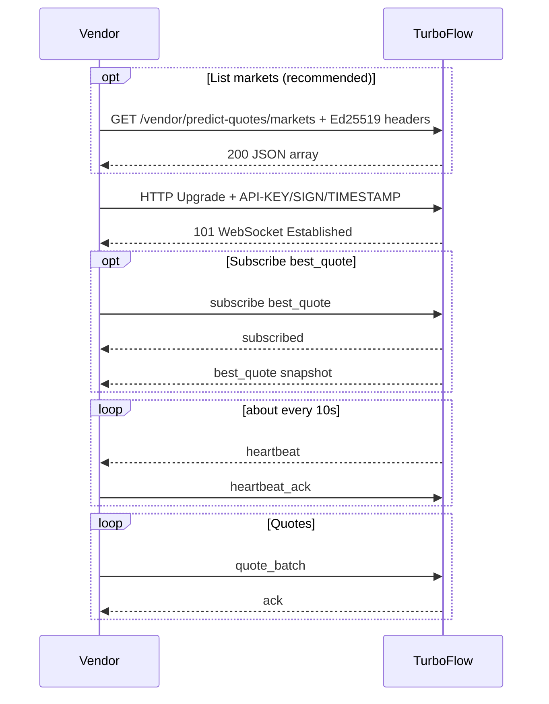

# Multi-Vendor Predict Odds - Vendor API Reference

| Item | Value |
| --- | --- |
| Document version | v2.2 |
| Last updated | 2026-06-03 |
| Audience | **External odds vendors** technical integration |
| Protocol | Phase 1 |
| Provider | TurboFlow |
| Chinese version | API文档 - 多vendor流动性路由方案 v2.2 CN.md |

---

## Table of Contents

1. [Overview](#1-overview)
2. [Connection and Authentication](#2-connection-and-authentication)
3. [General Conventions](#3-general-conventions)
4. [Supported Markets](#4-supported-markets)
5. [Message Protocol](#5-message-protocol)
6. [Integration Sequence](#6-integration-sequence)
7. [Error Codes and Rate Limits](#7-error-codes-and-rate-limits)
8. [Integration Checklist](#8-integration-checklist)
9. [Appendix](#9-appendix)

---

## 1. Overview

### 1.1 What TurboFlow Provides

TurboFlow exposes an **inbound WebSocket** endpoint. Vendors push up/down odds (`return_rate`) per predict market. The platform aggregates quotes from multiple vendors and selects the best price for display and order routing.

### 1.2 What Vendors Must Do

| Capability | Description |
| --- | --- |
| Open WebSocket | Authenticate with the Ed25519 `API-KEY / SIGN / TIMESTAMP` method issued by TurboFlow. |
| Query allowed markets, optional | Before connecting, call `GET /vendor/predict-quotes/markets`. |
| Push quotes continuously | Send `quote_batch`; include both `up` and `down` per market when possible. |
| Keep connection alive | Reply to server `heartbeat` with `heartbeat_ack` within 30 seconds. |
| Handle ack | Fix data based on `accepted`, `rejected`, and `errors`. |
| Subscribe to best quote, optional | Subscribe to `best_quote` to observe platform best odds, sanitized. |

### 1.3 What Vendors Do Not Do

| Item | Description |
| --- | --- |
| User order placement | Users still place orders through the existing App/API. This WebSocket carries no trading action. |
| Treat `best_quote` as an execution guarantee | `best_quote` is observational only. Real orders run server-side live selection again. |
| Competitor intelligence | `best_quote` never exposes winning vendor id, quote id, second-best price, or competitor details. |

### 1.4 Environments and Endpoints

TurboFlow exposes a **single public API host** (`{api_host}`) for both WebSocket and HTTP. Paths are fixed.

| Capability | Path | Description |
| --- | --- | --- |
| WebSocket quotes | `/ws/vendor/predict-quotes` | Connect, `quote_batch`, heartbeat, `best_quote`. |
| HTTP allowed markets | `/vendor/predict-quotes/markets` | `GET`, same auth as WebSocket; optional pre-connect query. |

Full URL format:

| Capability | URL |
| --- | --- |
| WebSocket | `wss://{api_host}/ws/vendor/predict-quotes` |
| HTTP allowed markets | `https://{api_host}/vendor/predict-quotes/markets` |

#### API Host by Environment

| Environment | `{api_host}` | WebSocket | HTTP allowed markets |
| --- | --- | --- | --- |
| **UAT** | `api.turboflow-test.xyz` | `wss://api.turboflow-test.xyz/ws/vendor/predict-quotes` | `https://api.turboflow-test.xyz/vendor/predict-quotes/markets` |
| **Production** | issued by ops | `wss://{prod_api_host}/ws/vendor/predict-quotes` | `https://{prod_api_host}/vendor/predict-quotes/markets` |

TurboFlow provides the public API key, private seed handoff channel, and `allowed_markets` per environment.

---

## 2. Connection and Authentication

### 2.1 Protocol Requirements

| Item | Value |
| --- | --- |
| Transport | WebSocket over `wss://`. |
| Frame type | JSON **text** frames, UTF-8. Phase 1 does not use binary frames. |
| Subprotocol | None. |

### 2.2 HTTP Upgrade Headers

Authentication is upgraded to the TurboFlow API authentication method:

`https://devdoc-3.gitbook.io/devdoc-docs/turboflow-api-doc-1#authentication`

WebSocket upgrade requests and HTTP `GET /vendor/predict-quotes/markets` requests must send these headers:

| Header | Type | Description |
| --- | --- | --- |
| `API-KEY` | string | Vendor Ed25519 public key, 64-character hex. Stored by TurboFlow in `vendor_api_keys.api_key`. |
| `SIGN` | string | Ed25519 signature hex generated for this request. |
| `TIMESTAMP` | string | Unix timestamp in seconds. Tolerance is +/- 300 seconds. |

If a WebSocket client cannot set headers, the same values may be sent as query parameters: `api_key`, `sign`, `timestamp`. Header authentication is preferred.

Do not use the old `X-API-KEY / X-API-TS / X-API-SIGN` HMAC flow for this v2.2 integration.

### 2.3 Signature Algorithm

For the current WebSocket and allowed-markets endpoints:

- Method is always `GET`.
- Body is empty.
- `path` is the pure URL path and excludes query parameters.
- Generate a fresh `TIMESTAMP` and `SIGN` for every connection/request. Never hardcode a signature.

Signing string:

```text
method=GET&path={path}&timestamp={timestamp}&access-key={apiKey}
```

Signature steps:

1. Build the signing string above.
2. Decode the hex `API-KEY` into bytes and use it as the HMAC-SHA256 key.
3. HMAC-SHA256 the signing string to produce a digest.
4. Decode the vendor private seed from hex and build the Ed25519 private key.
5. Ed25519-sign the HMAC digest.
6. Send the signature hex in `SIGN`.

Python example:

```python
import hashlib
import hmac
import time

from cryptography.hazmat.primitives.asymmetric.ed25519 import Ed25519PrivateKey


API_KEY = "your_64_hex_public_key"
PRIVATE_SEED = "your_64_hex_private_seed"
PATH = "/ws/vendor/predict-quotes"


def sign_request(path: str) -> dict[str, str]:
    timestamp = str(int(time.time()))
    message = f"method=GET&path={path}&timestamp={timestamp}&access-key={API_KEY}"
    digest = hmac.new(bytes.fromhex(API_KEY), message.encode("utf-8"), hashlib.sha256).digest()
    private_key = Ed25519PrivateKey.from_private_bytes(bytes.fromhex(PRIVATE_SEED))
    signature = private_key.sign(digest).hex()
    return {
        "API-KEY": API_KEY,
        "SIGN": signature,
        "TIMESTAMP": timestamp,
    }
```

For `GET /vendor/predict-quotes/markets`, sign the path `/vendor/predict-quotes/markets`. For WebSocket, sign `/ws/vendor/predict-quotes`.

### 2.4 Clock Skew

| Check | Rule |
| --- | --- |
| Auth header `TIMESTAMP` | `abs(server_now_sec - TIMESTAMP) <= 300`. |
| `quote_batch.sent_at` | Millisecond Unix timestamp. TurboFlow validates it against the configured quote clock-skew window. |

Exceeded auth timestamp skew returns **HTTP 401** before WebSocket establishment. Exceeded `quote_batch.sent_at` skew returns `CLOCK_SKEW` in `ack.errors`.

### 2.5 Authentication Failures

| Scenario | Behavior |
| --- | --- |
| Bad signature or timestamp skew | HTTP **401**, no WebSocket. |
| Vendor status is not enabled | Reject connection or disconnect immediately. |
| Max concurrent connections exceeded | HTTP **429**. |

### 2.6 Concurrent Connections

Per API key, same `vendor_id`, multiple concurrent WebSockets are allowed, capped by `max_inbound_connections` in `keeperPredictVendorRegistry`.

| Config | Meaning |
| --- | --- |
| Omitted or `0` | Default **5** concurrent connections. |
| `1` | Only one active inbound connection. A second connection receives **429**; the existing connection is not kicked. |
| `N > 1` | At most `N` concurrent connections. |

Each connection has independent heartbeat, rate limit, and `best_quote` subscription. Quotes share one vendor quote book; avoid conflicting `vendor_quote_id` across connections.

---

## 3. General Conventions

| Convention | Description |
| --- | --- |
| `type` | Required on every WebSocket message. |
| Timestamps | Millisecond Unix epoch (`int64`) in message payloads, unless a field explicitly says Unix seconds. |
| `return_rate` | String decimal in `(0, 1]`, for example `"0.80"`. TurboFlow truncates toward zero to at most 6 decimal places before selection. |
| `market` | `{SYMBOL}-{DURATION}`, for example `BTC-5m`, `ETH-1h`. |
| `pair_id` | TurboFlow event-contract market id. Include it when known; it is required in `best_quote` subscription `markets[]`. |
| `outcome` / `side` | `up` = bullish, `down` = bearish. |
| Idempotency | Per connection, `(vendor_id, vendor_quote_id)`: same content is accepted; different content returns `DUPLICATE_QUOTE_ID`. |

### 3.1 Quote Validity

| Rule | Description |
| --- | --- |
| Stays valid | Until a newer quote for the same market + side arrives, within the validity window. |
| Hard expiry | Default **5 minutes** without refresh; expired quotes are excluded from selection. |
| Refresh recommendation | Push a full `quote_batch` at least every **5 minutes**, even if prices are unchanged. |
| Disconnect | After heartbeat timeout, old quotes do not participate; reconnect and push `quote_batch` again. |

---

## 4. Supported Markets

### 4.1 Market Format

Aligned with legacy SIG:

```text
BTC-30s, BTC-1m, BTC-3m, BTC-5m, BTC-15m, BTC-1h
ETH-30s, ETH-1m, ETH-3m, ETH-5m, ETH-15m, ETH-1h
```

| Suffix | Duration, seconds |
| --- | --- |
| `*-30s` | 30 |
| `*-1m` | 60 |
| `*-3m` | 180 |
| `*-5m` | 300 |
| `*-15m` | 900 |
| `*-1h` | 3600 |

### 4.2 Permission Scope

Markets a vendor may push are exactly the `allowed_markets` configured for that vendor in the TurboFlow registry.

Important: empty `allowed_markets` means **all markets are rejected**. Confirm the list with TurboFlow before integration.

### 4.3 HTTP: List Allowed Markets

Before opening WebSocket, query allowed markets for the current API key.

| Item | Value |
| --- | --- |
| Method / path | `GET /vendor/predict-quotes/markets` |
| Base host | Same `{api_host}` as section 1.4. |
| Auth | Same `API-KEY / SIGN / TIMESTAMP` auth as section 2. |
| Success | HTTP **200**, JSON array body without wrapper. |
| No markets enabled | HTTP **200**, `[]`. |
| Auth failure | HTTP **401**. |
| Service unavailable | HTTP **502** / **503**, transient; retry briefly. |

Response example:

```json
[
  {
    "pair_id": 5,
    "market": "BTC-30s",
    "symbol": "BTC",
    "interval_in_seconds": 30
  },
  {
    "pair_id": 5,
    "market": "BTC-5m",
    "symbol": "BTC",
    "interval_in_seconds": 300
  }
]
```

| Field | Type | Description |
| --- | --- | --- |
| `pair_id` | int64 | TurboFlow event-contract market id. |
| `market` | string | Same as `quote_batch.market`, for example `BTC-5m`. |
| `symbol` | string | Underlying symbol, for example `BTC`. |
| `interval_in_seconds` | int64 | Duration in seconds. |

Python request example:

```python
import requests

headers = sign_request("/vendor/predict-quotes/markets")
response = requests.get(
    "https://api.turboflow-test.xyz/vendor/predict-quotes/markets",
    headers=headers,
    timeout=10,
)
response.raise_for_status()
print(response.json())
```

---

## 5. Message Protocol

### 5.1 Message Types

| Direction | `type` | Description |
| --- | --- | --- |
| Vendor -> Server | `hello` | Optional capability declaration. |
| Vendor -> Server | `quote_batch` | Core batch quote push. |
| Vendor -> Server | `subscribe` | Subscribe to `best_quote`. |
| Vendor -> Server | `unsubscribe` | Unsubscribe from `best_quote`. |
| Vendor -> Server | `heartbeat_ack` | Heartbeat reply. |
| Server -> Vendor | `ack` | `quote_batch` result. |
| Server -> Vendor | `subscribed` | Subscription confirmation. |
| Server -> Vendor | `best_quote` | Sanitized best quote push. |
| Server -> Vendor | `heartbeat` | Heartbeat probe. |
| Server -> Vendor | `error` | Error frame, for example subscription denied. |

### 5.2 Vendor -> Server Message Samples

#### (1) `hello`, optional

```json
{
  "type": "hello",
  "client_ts": 1757908892351,
  "markets": ["BTC-5m", "ETH-3m"]
}
```

#### (2) `quote_batch`, core quote push

```json
{
  "type": "quote_batch",
  "vendor_quote_id": "vendor-1757908892351-001",
  "sent_at": 1757908892351,
  "quotes": [
    {
      "pair_id": 5,
      "market": "BTC-5m",
      "outcomes": [
        {
          "outcome": "up",
          "return_rate": "0.80"
        },
        {
          "outcome": "down",
          "return_rate": "0.79"
        }
      ]
    }
  ]
}
```

#### (3) `subscribe`, get best_quote request

Use this message to request current and future sanitized best quotes.

```json
{
  "type": "subscribe",
  "topic": "best_quote",
  "markets": [
    {
      "pair_id": 5,
      "market": "BTC-5m"
    }
  ],
  "sides": ["up", "down"]
}
```

`markets[]` contains objects, not plain strings. Each object must identify the `pair_id` and `market` pair to avoid ambiguity.

#### (4) `unsubscribe`

```json
{
  "type": "unsubscribe",
  "topic": "best_quote",
  "markets": [
    {
      "pair_id": 5,
      "market": "BTC-5m"
    }
  ],
  "sides": ["up"]
}
```

#### (5) `heartbeat_ack`

```json
{
  "type": "heartbeat_ack",
  "server_ts": 1757908892399,
  "client_ts": 1757908892405
}
```

### 5.3 Server -> Vendor Message Samples

#### (1) `ack`, all accepted

```json
{
  "type": "ack",
  "vendor_quote_id": "vendor-1757908892351-001",
  "accepted": 2,
  "rejected": 0,
  "server_ts": 1757908892399
}
```

#### (2) `ack`, partial reject

```json
{
  "type": "ack",
  "vendor_quote_id": "vendor-1757908892351-002",
  "accepted": 1,
  "rejected": 1,
  "server_ts": 1757908892399,
  "errors": [
    {
      "market": "BTC-5m",
      "outcome": "down",
      "code": "QUOTE_OUT_OF_RANGE",
      "message": "return_rate must be in (0, 1]"
    }
  ]
}
```

#### (3) `subscribed`

```json
{
  "type": "subscribed",
  "topic": "best_quote",
  "markets": [
    {
      "pair_id": 5,
      "market": "BTC-5m"
    }
  ],
  "sides": ["up", "down"],
  "server_ts": 1757908892399
}
```

#### (4) `best_quote`, valid snapshot or update

```json
{
  "type": "best_quote",
  "event": "snapshot",
  "pair_id": 5,
  "market": "BTC-5m",
  "side": "up",
  "status": "valid",
  "return_rate": "0.80",
  "quote_ts": 1757908892351,
  "selected_at": 1757908892399,
  "quote_age_ms": 48,
  "routing_strategy": "best_return_rate"
}
```

#### (5) `best_quote`, no valid quote

```json
{
  "type": "best_quote",
  "event": "update",
  "pair_id": 5,
  "market": "BTC-5m",
  "side": "up",
  "status": "no_valid_quote",
  "reason": "all_quotes_expired_or_unavailable",
  "selected_at": 1757908894399
}
```

#### (6) `heartbeat`

```json
{
  "type": "heartbeat",
  "server_ts": 1757908892399
}
```

#### (7) `error`

```json
{
  "type": "error",
  "code": "SUBSCRIPTION_DENIED",
  "message": "vendor is not allowed to subscribe to best_quote",
  "server_ts": 1757908892399
}
```

### 5.4 Heartbeat Rules

| Parameter | ms | Description |
| --- | --- | --- |
| `heartbeat_interval_ms` | 10000 | Server sends `heartbeat` about every 10 seconds. |
| `heartbeat_timeout_ms` | 30000 | Disconnect if no `heartbeat_ack` is received within 30 seconds. |

### 5.5 best_quote Privacy and Semantics

`best_quote` never includes:

- `winning_vendor_id`
- `vendor_id`
- `pool_id`
- `quote_id`
- `is_own_quote`
- `second_best_quote`
- Any competitor identity or quote depth.

Important: `best_quote` is **not** an execution guarantee. User orders re-run selection at submit time.

---

## 6. Integration Sequence



---

## 7. Error Codes and Rate Limits

### 7.1 `ack.errors` Codes

| code | Description | Suggested Action |
| --- | --- | --- |
| `QUOTE_OUT_OF_RANGE` | `return_rate` not in `(0, 1]`. | Fix rate value. |
| `MARKET_INVALID` | Market not parseable / not configured. | Check market string. |
| `MARKET_NOT_ALLOWED` | Not in `allowed_markets`. | Contact TurboFlow. |
| `CLOCK_SKEW` | `sent_at` out of skew window. | Sync NTP, resend. |
| `DUPLICATE_QUOTE_ID` | Same `vendor_quote_id`, different content. | Use new ID or send identical content. |
| `MISSING_OUTCOME` | Empty `outcomes`. | Add `up` / `down`. |
| `POOL_NOT_CONFIGURED` | Vendor pool not configured. | Contact TurboFlow. |
| `RATE_LIMITED` | Rate limit exceeded. | Slow down and retry. |

### 7.2 Connection-Level Errors

| Scenario | Behavior |
| --- | --- |
| Auth failure | HTTP **401**. |
| Vendor disabled | Disconnect. |
| Reject ratio high | More than 30% rejects for 1 minute -> disconnect. |
| Heartbeat timeout | Disconnect; quotes invalid. |
| Push too fast | More than 20 `quote_batch` / second / connection -> throttle or disconnect. |

After disconnect, reconnect and push `quote_batch` again.

### 7.3 Limits

| Rule | Threshold |
| --- | --- |
| `quote_batch` rate | <= 20 / second / connection. |
| Batch size | <= 24 markets, <= 2 outcomes per market. |
| Reject disconnect | More than 30% for 1 minute. |
| Heartbeat timeout | 30 seconds without `heartbeat_ack`. |

---

## 8. Integration Checklist

- Ed25519 `API-KEY / SIGN / TIMESTAMP` auth implemented.
- Fresh `TIMESTAMP` and `SIGN` generated for every request/connection; no hardcoded signature.
- Recommended: call `GET /vendor/predict-quotes/markets` before connecting to verify `allowed_markets`.
- `quote_batch` implemented; refresh at least every 5 minutes.
- `subscribe` / `unsubscribe` for `best_quote` uses `markets[]` objects with `pair_id` and `market`.
- `ack` / `errors` handled.
- `heartbeat` -> `heartbeat_ack` completed within 30 seconds.
- Reconnect and re-push quotes after disconnect.
- Optional `best_quote` subscription is understood as non-binding.
- UAT covers multi-market, up/down, reconnect, clock skew, partial reject, and subscription behavior.

---

## 9. Appendix

### 9.1 Contacts

| Topic | Contact |
| --- | --- |
| API key, private seed handoff, hosts | TurboFlow business / ops |
| `allowed_markets`, pool config | TurboFlow technical contact |
| UAT window | Agreed with TurboFlow |

### 9.2 Revision History

| Version | Date | Notes |
| --- | --- | --- |
| v2.2.2 | 2026-06-03 | Upgraded authentication to TurboFlow Ed25519 `API-KEY / SIGN / TIMESTAMP`; added concrete samples for every WebSocket message type, including `best_quote` subscription request with `pair_id` + `market`. |
| v2.2.1 | 2026-05-27 | Updated endpoint hosts from the shared endpoint reference. |
| v2.2 | 2026-05-27 | Single public API host only; internal Plan A/B hidden from vendors. |
| v2.1.1 | 2026-05-27 | Historical environment host setup. Current external docs expose UAT only. |
| v2.1 | 2026-05-27 | Document cex-api `GET /vendor/predict-quotes/markets` route and proxy; English edition. |
| v2.0 | 2026-05-23 | Initial vendor-facing API doc. |
